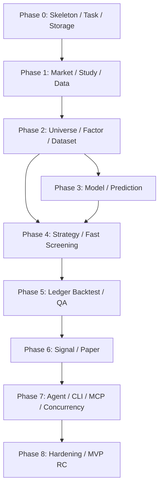
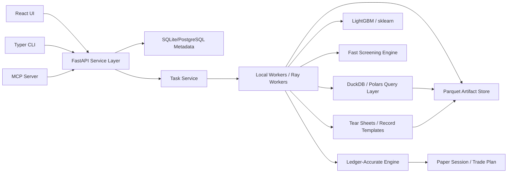

# QAgent Next 全新项目需求规格说明

> 文档状态：新项目开发依据  
> 编写日期：2026-05-17  
> 项目定位：从零开发的新一代本地量化研究、策略优化与 T+1 计划交易系统  
> 历史输入：QAgent 旧版单市场链路、多市场扩展链路、3.x 研究内核和策略图经验  
> 重要约束：本文档不是现有仓库的迭代计划，不要求兼容旧代码、旧接口、旧数据库或旧 UI。历史版本只作为能力盘点和经验来源。

## 1. 总述

QAgent Next 是一个从零开发的本地优先、单用户、日频量化研究和计划交易系统。系统的最终目标有两个：第一，自主研究高收益策略、模型和因子，持续产出可比较的量化结果，例如综合夏普率、收益率、回撤、换手、胜率和信号质量；第二，让 human 从候选策略中选择最优策略进入模拟交易，长期跟踪表现，获取 T 日生成的 T+1 交易计划，并由 human 人工跟盘执行。

本项目的首要产品方向是提升研究和策略表达的优化空间。系统必须让因子、模型和策略作者能够自由表达 alpha、选股、组合构建、仓位调整、订单意图和状态机，同时用统一 T+1 执行、记账、诊断和复现合约兜住时间正确性和风险边界。新系统不是把策略限制在少数 UI 参数里，而是提供一套可组合、可审计、可回测、可用于 paper 的策略运行内核。策略能力的优先级高于资产库完整度和可视化编辑器完整度：MVP 可以没有复杂图形化编排，但必须让研究者用 SDK 和结构化配置写出足够灵活的策略。

新项目要整合历史版本中已经证明有价值的能力：

- 旧版完整研究链路：数据管理、股票池、因子、特征、标签、模型、策略、回测、信号、模拟交易。
- 多市场经验：US equities 和 China A-shares 都必须是一等市场，不能用后补 `market` 字段硬拼。
- 3.x 研究内核经验：Research Run、Artifact、Lineage、Dataset、Model Package、Strategy Graph、QA、Promotion、Reproducibility Bundle。
- agent 接口经验：agent 可以通过 REST、CLI 或 MCP 调用系统能力。接口能力可以超过 UI 覆盖范围，用于批量研究、调试、自动化和高级诊断；但不能绕过服务层校验、权限确认、审计记录或复现要求。
- 策略重构经验：策略不能继续膨胀成一个巨型函数，也不能被固定 pipeline 过度限制。alpha、选股、组合、风控、仓位、订单意图、执行、状态必须有清晰合约，策略作者可以选择接入层级。

新项目的核心目标是建立一个清晰、可实现、可复现、可长期运行的日频研究和模拟交易基础设施，而不是复刻旧系统代码。

## 2. 产品定位

### 2.1 一句话定位

QAgent Next 是一个本地优先的日频量化研究和计划交易工作台，用自主研究流程寻找候选因子、模型和策略，用人工决策选择策略进入模拟交易，并按 T 日生成 T+1 交易计划的方式长期跟踪执行效果。

### 2.2 目标用户

- Human Research Owner：提出研究目标、选择候选策略、批准模拟交易、人工跟盘执行。
- Quant Research User：编写或调整因子、模型、策略、组合和交易计划逻辑。
- Agent / CLI Client：通过 REST、CLI 或 MCP 调用系统能力，执行 UI 覆盖的主流程，以及 UI 未必提供的批量研究、回测、调试、诊断和自动化能力。
- Audit / Review User：审查数据质量、泄漏风险、回测证据、复现完整性和模拟交易表现。

### 2.3 非目标

- 不接入实盘券商，不做真实下单。
- 不做分钟、Tick、高频或盘口级撮合。
- 不做多用户权限体系。
- 不承诺免费数据源可达到发布级数据质量。
- 不把系统做成 agent 调度控制平面；agent 只作为接口、CLI 或 MCP 调用方。
- 不让 agent 或接口绕过服务层、权限、确认、审计和复现要求；接口可以覆盖 UI 未展示的高级能力，但这些能力必须受控。
- 不兼容旧 StrategyBase runtime、旧数据库 schema、旧 REST/MCP 工具或旧 UI 路由。

## 3. 新项目必须解决的问题

### 3.1 自主研究和人工选优割裂

历史版本中，研究任务、回测结果、候选策略、人工批准和模拟交易之间容易割裂。新项目必须把一个研究问题抽象成系统内的第一类对象，让目标、限制、试验、失败、指标、证据、人工决策、T+1 信号、模拟交易表现和复现都挂在同一条线上。

### 3.2 US/CN 市场语义割裂

历史版本先有 US equities，再横向接入 A 股，造成 provider、calendar、benchmark、ticker、交易规则、数据质量和资产依赖分散。新项目必须从第一天以 Market Profile 建模市场，所有市场相关资产都只通过 Market Profile 解析。

### 3.3 策略灵活性不足和接口膨胀并存

历史策略接口从 `signal/weight/strength` 开始，逐步塞入模型预测、持仓状态、计划价、执行配置、诊断和状态逻辑，最终既臃肿又不够灵活。新项目必须定义分层策略合约，让策略作者按需要实现 alpha、候选池、目标仓位、订单意图或状态机中的任意组合；系统负责 schema 校验、执行、记账、诊断和复现。

### 3.4 研究结果不可复现

旧链路里很多结果依赖运行时状态、缓存、源码文件、配置和隐含默认值。新项目必须规定任何 candidate、validated、published 结果都能回答：用什么数据、什么代码、什么配置、什么依赖、什么任务产生。

### 3.5 长任务和并发脆弱

日频量化研究仍有长任务：数据更新、因子计算、dataset materialization、模型训练、回测、信号、paper advance。新项目必须将长任务、资源租约、取消、超时、晚到结果隔离、幂等和恢复作为基础能力。

## 4. 系统不变量

1. REST、CLI、MCP、UI 必须复用同一服务层。
2. UI、REST、CLI、MCP 看到的是同一套对象、状态、证据和结果。
3. 所有长任务必须返回 `task_id`，并通过任务状态查询结果。
4. 所有正式研究结果必须绑定 Study、Run、Artifact、Lineage 和 Reproducibility Bundle。
5. 所有 market-scoped 对象必须绑定一个 Market Profile，跨市场依赖必须被拒绝。
6. 所有市场时间序列验证必须使用时间切分、滚动、扩展或 purge-gap，不得使用随机 K-Fold。
7. 所有策略决策输入必须满足 `available_at <= decision_time`。
8. 标签可以使用未来收益，但只能用于训练/评估，不能进入决策输入。
9. 回测、正式信号和模拟交易必须使用同一套执行语义。
10. 数据源质量必须显式暴露，非 PIT 数据不能被 promotion 流程默认为发布级。
11. 用户自定义代码必须隔离运行，不能直接写数据库或访问未授权路径。
12. 缓存只是性能层，不是正式研究资产。
13. 策略层必须“开放表达、封闭执行”：策略可以自由产生标准化目标或订单意图，但成交、现金、持仓、成本和审计必须由系统统一处理。
14. 策略能力必须以 typed node、标准对象和版本化参数组合表达；新增策略形态优先扩展节点合约，而不是继续膨胀单个 strategy interface。
15. 系统必须以 T+1 计划交易为核心语义：T 日生成 T+1 交易计划，回测、信号和模拟交易都围绕该语义构建。
16. REST、CLI、MCP 可以是 UI 的能力超集，但必须共享相同服务层、权限模型、确认流程和审计记录。
17. 系统必须支持“亏损/盈利归因 -> 因子想法 -> 批量实验 -> 参数/组合优化 -> 入库保留”的因子研究闭环。
18. 系统必须支持“因子库 -> 150+ 特征集 -> 自定义学习目标 -> 模型训练 -> 统一回测 -> 非同质化保留”的模型研究闭环。
19. 系统必须支持“特征/模型引用 -> 自由信号构建 -> 自由交易模式 -> 灵活仓位控制 -> T+1 回测和模拟交易”的策略研究闭环。
20. 系统必须把“多个训练任务和多个回测任务同时提交”作为默认运行场景，而不是异常场景；任务调度、资源隔离、缓存复用、写入序列化和 UI/API 响应必须围绕该场景设计。

### 4.1 性能和可实现性原则

新项目必须避免把“可审计”误做成“所有中间面板都逐行写数据库”。默认实现应遵守以下原则：

- 元数据进结构化数据库，大型面板进列式 artifact store。
- 大型 time-series / cross-section 数据使用 Parquet/Arrow 等列式格式分区保存，数据库只保存索引、hash、schema、路径和摘要。
- 默认只保存 summary、ledger 和可复现引用；完整节点 trace、逐资产逐日解释、宽特征矩阵快照只在用户请求 explain/debug 或 promotion evidence 时生成。
- 策略调试必须默认按单日、单阶段或小日期窗口执行；全区间逐节点 trace 只能作为显式 debug task。
- 批量研究必须优先复用已物化的 factor values、feature matrix、prediction artifact 和 backtest cache，避免每个 trial 重算全链路。
- 大规模试验必须有预算和早停机制：最大 trial 数、最大并发数、最大日期范围、最大资产数、最大运行时间、最低样本覆盖率。
- 训练任务和回测任务必须进入统一调度层，不能由 API 请求线程直接执行；同一时间允许多个任务排队和运行，但必须受 CPU、内存、磁盘 IO、GPU、metadata writer 和 market/date artifact lock 配额约束。
- 并发任务必须区分 compute-heavy、io-heavy、metadata-write-heavy 和 latency-critical 队列；Paper Advance、T+1 Signal、手工调仓校验不能被探索性训练/回测长期阻塞。
- MVP 优先实现一个高质量 US_EQ 全链路和一个 CN_A 探索级闭环，不在第一阶段追求所有市场规则、所有订单类型和所有模型目标。
- 任何新增需求如果会导致全市场、全日期、全节点、全订单无条件持久化，必须降级为按需生成或后续增强。

### 4.2 成熟系统借鉴原则

新项目应吸收成熟量化系统的工程经验，但不绑定或兼容任何外部框架：

- 借鉴 QuantConnect LEAN 的模块化策略框架：Universe、Alpha、Portfolio、Execution、Risk 必须有清晰边界和可替换合约。
- 借鉴 Qlib 的实验记录模式：模型预测、信号分析、组合回测应形成标准 Record Template，而不是散落为临时文件。
- 借鉴 Backtrader 的策略生命周期和 analyzer：策略必须有 warmup、start、decision、order notification、trade notification、stop 等可观察阶段。
- 借鉴 Zipline Pipeline 的 Factor / Filter / Classifier 思路：特征和筛选应支持横截面 rank、quantile、group transform、mask 和组合表达。
- 借鉴 Alphalens 和 Pyfolio 的 tear sheet：因子、模型、策略、交易和持仓必须有标准诊断报告。
- 借鉴 vectorbt 的批量参数和向量化思想：大规模 trial 先走高性能筛选，再对候选进入精确账本回测和 T+1 模拟交易。

## 5. 范围

### 5.1 MVP 范围

MVP 必须完成以下闭环：

1. 创建 Study，定义市场、股票池、日期范围、目标和预算。
2. 接入 US_EQ 和 CN_A 两个 Market Profile；US_EQ 完整闭环，CN_A 完成探索级数据、Universe、Dataset、Backtest smoke。
3. 管理股票资产、日线行情、指数行情、数据质量声明。
4. 创建 Universe、Factor、Feature Pipeline、Label Spec、Dataset。
5. 支持基于策略亏损/盈利归因生成因子想法，批量实验并保留成功因子。
6. 基于因子库构建至少 150 个特征的 Feature Pipeline，并基于 Dataset 自主训练和评估模型，保存 Model Experiment、Model Package 和可比较指标。
7. 创建灵活 Strategy Graph，至少支持 alpha-only、target-weight、order-intent 和 stateful 四种策略接入模式。
8. 提供 Strategy SDK 和最小 Strategy Studio，用于创建、校验、克隆、参数化、单日模拟和解释策略图。
9. 运行 Strategy Variant 回测，输出综合夏普率、收益率、回撤、换手、信号质量、订单级执行诊断和按需策略决策解释。
10. 支持候选策略排行、人工选择、QA Gate 和 Promotion Decision。
11. 为 US_EQ 生成 T 日的 T+1 交易计划和 paper session；CN_A 在数据质量和交易规则不足时只能生成 exploratory signal。
12. Paper Session 必须支持长期跟踪表现、生成每日 T+1 信号，并允许 human 调整模拟持仓。
13. 导出复现包。
14. Agent/CLI 可通过 REST、CLI 或 MCP 完成 UI 主流程，并可调用受控的高级批量、调试和自动化接口。

### 5.2 后续增强

- 宏观数据 PIT realtime window。
- 更完整的 CN_A tradability：涨跌停、停牌、ST、上市天数、手数、涨跌停价格精度。
- 更丰富的订单类型：multi-day GTC、partial fill、TWAP/VWAP 日频近似、volume participation cap。
- pairwise/listwise 训练目标和更复杂的排序损失。
- daily approximate limit / stop / stop-limit 订单。
- 可视化 graph editor、更复杂的组合约束、插件化策略节点市场。
- 外部 CLI/MCP 结果导入和批量研究 dashboard。

## 6. 顶层领域模型

### 6.1 核心对象

| 对象 | 职责 |
| --- | --- |
| Study | 一个完整研究工作单元，承载目标、约束、试验、候选、证据、决策和最终结论 |
| Research Objective | 自主研究目标、指标权重、约束和搜索预算 |
| Research Trial | 一次因子、模型或策略试验 |
| Trial Result | 一次试验的指标、诊断、失败原因和产物引用 |
| Research Insight | 来自归因、人工输入或网络资料的研究灵感 |
| Factor Idea | 可实验的因子想法、来源、假设、适用市场和预期方向 |
| Strategy Candidate | 可被 human 选择进入模拟交易的候选策略版本 |
| Manual Decision | Human 对候选策略、模拟交易、调仓、override、清理和发布的决策 |
| Research Run | 一次系统执行事实，如 dataset materialize、model train、backtest |
| Artifact | JSON、Parquet、模型文件、报告、图表数据、诊断 trace 等产物 |
| Lineage Edge | 输入、输出、依赖和产物之间的有向关系 |
| Market Profile | 市场身份、交易语义和默认策略节点集合 |
| Data Policy | provider、字段语义、复权语义和质量等级 |
| Trading Rule Set | 日历、T+1/T+0、涨跌停、停牌、手数、可交易性 |
| Cost Model | 佣金、滑点、税费和成交成本 |
| Benchmark Policy | 默认 benchmark 和指数语义 |
| Asset | 股票、ETF、指数等可引用资产 |
| Universe | 研究股票池定义 |
| Dataset | 模型训练和评估的样本面板定义与物化结果 |
| Factor Spec | 因子定义、源码、参数、输入和适用市场 |
| Feature Pipeline | 特征构造和预处理流程 |
| Feature Set | 一组可复用特征，MVP 模型研究默认不少于 150 个特征 |
| Label Spec | 标签定义、horizon、目标类型和泄漏约束 |
| Model Experiment | 一次模型训练实验 |
| Model Package | 可复用模型包 |
| Strategy Graph | 分层策略定义 |
| Strategy Node Spec | 一个策略节点的实现、输入输出 schema、参数 schema 和能力声明 |
| Strategy Variant | Strategy Graph、节点选择、参数和依赖快照形成的一次可比较策略版本 |
| Strategy Decision Trace | 按需生成的单日或小窗口策略节点输出和解释 |
| Order Intent | 策略生成的低频可审计订单意图 |
| Trade Plan | T 日生成的 T+1 计划交易清单 |
| Execution Report | 成交、阻断、fallback、成本和持仓变化 |
| Backtest Run | Strategy Variant 在历史区间上的模拟 |
| Production Signal Run | 正式信号生成记录 |
| Paper Session | 模拟交易会话 |
| Manual Position Adjustment | Human 在模拟交易中对持仓的人工调整 |
| QA Report | 质量检查和阻断项 |
| Promotion Record | 候选资产晋级或拒绝记录 |
| Reproducibility Bundle | 复现所需的完整索引包 |
| Tear Sheet | 因子、模型、策略或组合的标准诊断报告 |
| Analyzer | 回测或模拟交易过程中可插拔的指标与诊断计算器 |
| Pipeline Expression | 类 Pipeline 的特征、过滤、分类、rank、quantile 和 mask 表达 |

### 6.2 生命周期

所有研究对象必须支持统一生命周期：

- scratch：临时探索，可清理。
- experiment：实验中，可复算。
- candidate：候选，必须保留证据。
- validated：通过 QA，可用于 paper。
- published：正式发布或长期保留。
- archived：归档，不再作为默认候选。

### 6.3 保留等级

- cache：可重建缓存。
- standard：普通实验产物。
- evidence：验证证据。
- protected：候选或已验证资产。
- published：发布级复现包。
- archive：历史归档。

## 7. Market Foundation 需求

### 7.1 Market Profile

系统必须内置两个 profile：

- `US_EQ`：US equities，默认 benchmark 可配置为 SPY 或更明确的指数资产，交易日历为 US equity calendar。
- `CN_A`：China A-shares，默认 benchmark 可配置为沪深300或等价指数资产，交易日历为 A 股交易日历。

功能需求：

- MF-001：所有 market-scoped 对象必须保存 `market_profile_id`。
- MF-002：任何跨 profile 依赖必须在保存或运行前失败。
- MF-003：UI、CLI 和 MCP 输入可以提供 market alias，但服务层内部必须只使用 profile。
- MF-004：Market Profile 必须引用 Data Policy、Trading Rule Set、Cost Model、Benchmark Policy。
- MF-005：Market Profile 必须可导出为 JSON snapshot，进入复现包。

### 7.2 Data Policy

功能需求：

- DP-001：每个 provider/dataset 必须声明 quality level。
- DP-002：必须声明 PIT supported、survivorship safe、corporate action coverage、license scope。
- DP-003：免费数据源默认不视为 PIT。
- DP-004：宏观数据不进入 MVP；后续接入时必须区分 observation date、realtime window、available_at。未实现 realtime replay 时必须阻断 publication-grade。
- DP-005：任何 backtest、signal、paper 结果必须引用 data policy snapshot。

### 7.3 Trading Rule Set

功能需求：

- TR-001：系统必须支持 decision date 和 execution date 分离。
- TR-002：系统默认语义必须是 T 日收盘后生成 T+1 交易计划，并在 T+1 按配置价格执行。
- TR-003：系统必须支持 T+1 next open 执行语义。
- TR-004：系统必须支持 T+1 next close 执行语义。
- TR-005：CN_A 必须预留停牌、涨跌停、ST、上市天数、手数和最小交易单位字段；MVP 允许标记为 unknown，并在 publication-grade 和 paper 执行前阻断或要求 Manual Decision override。
- TR-006：每个 block reason 必须可追踪到具体市场规则。
- TR-007：任何策略、回测、正式信号和模拟交易不得默认使用 T 日无法获得的 T+1 成交价格作为决策输入。

## 8. 数据管理需求

### 8.1 资产和行情

功能需求：

- DATA-001：系统必须管理 Asset，包括 symbol、name、exchange、asset type、status、market profile。
- DATA-002：系统必须管理 provider symbol 和内部 asset_id 的映射。
- DATA-003：系统必须存储日线 OHLCV、复权因子、数据来源和数据版本；row-level `available_at` 仅在 provider 能提供时保存，否则由 Data Policy 生成保守可用性规则。
- DATA-004：系统必须存储指数行情，并明确指数是否可交易。
- DATA-005：系统必须提供按 asset/date 范围查询 bars 的 API。
- DATA-006：系统必须提供数据覆盖状态：资产数、bar 数、日期范围、最新交易日、缺失率、stale assets。
- DATA-007：系统必须提供横截面诊断：某个 universe 某日缺行情、缺交易状态、缺因子。

### 8.2 数据更新

功能需求：

- DATA-101：数据更新必须是长任务。
- DATA-102：MVP 支持增量更新、指定 asset 更新、指定 universe 更新；全量更新作为受控维护操作，不作为日常主流程入口。
- DATA-103：全量或大范围数据更新需要 Manual Decision 或明确的受控接口确认，并必须显示预计影响范围。
- DATA-104：更新任务必须记录 provider、请求参数、开始/结束时间、成功/失败 asset 数、失败原因。
- DATA-105：数据写入必须幂等，重复运行不能产生重复 bars。

### 8.3 数据质量

功能需求：

- DATA-201：系统必须暴露 data quality contract。
- DATA-202：QA 必须读取 data quality contract 并生成 publication gates。
- DATA-203：非 PIT 数据源可以用于 exploratory research，但 promotion 必须标注限制。
- DATA-204：数据缺口、异常价格、复权缺失、交易状态缺失必须进入 diagnostics。

## 9. Universe 需求

功能需求：

- UNI-001：支持静态 universe：用户直接提供 asset 列表。
- UNI-002：支持规则 universe：按 market、exchange、sector、status、index membership 等过滤。
- UNI-003：支持 provider/index universe：从指数成分或外部来源生成。
- UNI-004：Universe membership 必须可物化，并保存 snapshot。
- UNI-005：如果 membership 不是 PIT，必须标记为 snapshot membership。
- UNI-006：Universe profile 必须提供成员数、覆盖率、上市时间分布、缺行情统计。
- UNI-007：任何 Dataset、Backtest、Signal、Paper 都必须引用 universe 或等价 asset scope。

## 10. 因子需求

### 10.1 因子研究流程

因子研究必须从策略表现出发，而不是只从人工预设公式出发。agent 可以根据以往策略亏损、盈利、回撤、错过机会、交易阻断和持仓偏离进行归因，提炼新因子或改进已有因子。

功能需求：

- FAC-0001：系统必须支持从 Backtest、Paper Session、Trade Plan、Execution Report 中生成 factor research brief。
- FAC-0002：factor research brief 至少包含收益/亏损区间、主要标的、市场状态、已有因子暴露、模型预测、交易动作、失败原因和候选改进方向。
- FAC-0003：Agent 可以联网寻找因子构建灵感，但必须保存资料来源、摘要、适用假设、引用时间和可信度标记。
- FAC-0004：网络灵感不能直接进入候选因子库，必须先转化为 Factor Idea 并经过本地实验验证。
- FAC-0005：Factor Idea 必须记录 hypothesis、expected direction、market applicability、required data、risk of leakage、implementation sketch。
- FAC-0006：同一原始思路即使首轮表现为负向，也不得自动 close；系统必须允许反向使用、分市场/分 regime 测试、参数调整、中性化调整、组合使用或失败原因归档。
- FAC-0007：Factor Idea 必须支持状态：idea、implemented、tested、needs refinement、combine candidate、accepted、rejected、archived。
- FAC-0008：成功因子进入 Factor Library 前必须有 Factor Evaluation、至少一个关联 Trial Result 和可复现 artifact。

### 10.2 Factor Spec

功能需求：

- FAC-001：因子定义必须保存 source code 或 declarative expression。
- FAC-002：因子必须声明 required inputs、warmup、params schema、default params、compute mode、applicable market profiles。
- FAC-003：因子 preview 不写正式 factor values。
- FAC-004：因子 materialize 写入 Factor Run 和 factor values 或 artifact。
- FAC-005：因子源码和参数 hash 必须进入 lineage。
- FAC-006：自定义因子代码必须隔离执行，不能直接访问数据库。
- FAC-007：全市场因子结果默认写入列式 artifact，并在数据库中保存索引和摘要；禁止把大规模因子面板逐行写入元数据表作为默认路径。
- FAC-008：因子必须声明 expected polarity：positive、negative、nonlinear、conditional、unknown。
- FAC-009：因子必须支持 parameter grid / parameter search 定义，并进入 Trial Result。
- FAC-010：因子必须支持 derivation refs，追踪来自哪个 Research Insight、Factor Idea、策略归因或网络来源。

### 10.3 Factor Evaluation

功能需求：

- FAC-101：支持 IC、rank IC、IR、IC win rate、coverage、turnover、group returns、long-short return。
- FAC-102：评估必须绑定 label spec、universe、date range 和 market profile。
- FAC-103：评估结果必须保存 daily series 和 summary。
- FAC-104：评估必须能输出失败原因：缺行情、缺 label、缺 factor、coverage 不足。
- FAC-105：评估必须支持按市场、行业、波动 regime、上涨/下跌区间、盈利/亏损交易集合做切片。
- FAC-106：负向 IC 或负向收益因子必须标记 polarity review，不得直接删除；系统应支持反向因子、非线性变换或组合后复测。
- FAC-107：评估必须支持 factor correlation / redundancy 检查，避免因子库堆积高度同质因子。

### 10.4 多因子组合和因子优化

功能需求：

- FAC-201：系统必须支持多因子组合试验，包括 equal weight、IC weighted、rank aggregation、model-based combination。
- FAC-202：多因子组合必须记录成员因子、权重、参数、相关性、覆盖率和贡献分解。
- FAC-203：因子优化必须支持参数调整、lookback 调整、winsorization、neutralization、lagging、market/regime conditional transform。
- FAC-204：系统必须能将单因子、多因子组合和模型特征集关联，追踪因子进入模型或策略后的边际贡献。
- FAC-205：因子入库保留标准必须同时考虑收益提升、回撤降低、亏损规避、覆盖率、稳定性和非同质化。

### 10.5 Factor Tear Sheet

功能需求：

- FAC-301：系统必须生成标准 factor tear sheet。
- FAC-302：Factor tear sheet 至少包含 IC/rank IC 序列、IC 分布、分 quantile 收益、long-short 收益、turnover、coverage、分组暴露、行业/市值/波动切片。
- FAC-303：Factor tear sheet 必须能对比 baseline factor 和 trial factor。
- FAC-304：Factor tear sheet 只保存 summary 和图表数据引用，完整明细按需读取 artifact。

## 11. Feature、Label、Dataset 需求

### 11.1 Feature Pipeline

功能需求：

- FEAT-001：Feature Pipeline 由 factor refs 和 preprocessing nodes 组成。
- FEAT-002：预处理节点必须显式声明行为：missing handling、winsorization、normalization、neutralization、lagging。
- FEAT-003：任何预处理节点不得静默降级为无操作；不支持必须失败。
- FEAT-004：Feature Pipeline 必须可 profile：缺失率、相关性、分布、漂移、覆盖。
- FEAT-005：模型研究使用的基础 Feature Set 默认不得少于 150 个有效特征；少于 150 个必须由 Research Objective 明确允许并记录原因。
- FEAT-006：Feature Set 必须支持从 Factor Library、Factor Combination、价格衍生特征、交易状态特征、市场/行业上下文特征构建。
- FEAT-007：Feature Set 必须保存 feature catalog：feature name、factor ref、params、category、market applicability、missing rate、coverage、correlation group。
- FEAT-008：Feature Set 必须提供 redundancy profile，用于识别高度相关、重复或低贡献特征。
- FEAT-009：Feature Set 必须支持版本化；新增、删除、替换特征必须生成新版本，不能覆盖已训练模型依赖的 feature schema。
- FEAT-010：大特征矩阵必须列式存储并支持按日期、asset、feature subset 读取，避免训练和回测时反复全量加载。
- FEAT-011：Feature Pipeline 必须支持 Pipeline Expression，包括 factor、filter、classifier、rank、quantile、zscore、groupby transform、mask。
- FEAT-012：Pipeline Expression 必须能被静态分析，输出 required data、warmup、market applicability、leakage risk 和可下推计算计划。
- FEAT-013：横截面 rank / quantile / neutralization 必须明确 group scope 和 mask，避免跨市场或跨 universe 混算。

### 11.2 Label Spec

MVP 必须支持以下 label 类型：

- forward return。
- excess return。
- cross-sectional rank。
- binary return。
- top/bottom quantile。

后续增强支持：

- large move。
- path return。
- path quality。
- trend continuation。
- triple barrier。
- composite label。
- prediction-derived label。
- custom objective label。

功能需求：

- LABEL-001：每个 Label Spec 必须声明 horizon 和 effective horizon。
- LABEL-002：Label 计算必须明确 label 只能用于训练/评估。
- LABEL-003：excess return 类 label 必须引用 benchmark policy。
- LABEL-004：composite label 必须能追踪子 label。
- LABEL-005：Label values 可以缓存，但正式 Dataset 必须保存 label spec snapshot。
- LABEL-006：系统必须支持自定义学习目标，至少允许用户定义 label transform、sample weight、loss target type 和 evaluation metric。
- LABEL-007：自定义学习目标必须声明是否可用于训练、评估、排序或策略信号，不能默认进入交易决策输入。
- LABEL-008：自定义 label / objective 必须做泄漏检查，并进入 Dataset 和 Model Package snapshot。

### 11.3 Dataset

Dataset 是模型训练唯一入口。

功能需求：

- DS-001：Dataset 必须引用 market profile、universe、feature pipeline、label spec、date range、split policy。
- DS-002：Dataset materialization 必须是长任务。
- DS-003：Dataset profile 必须包含样本数、日期范围、asset 数、缺失率、label 分布、split 分布、feature 覆盖。
- DS-004：Dataset 必须检查 feature available_at 和 label horizon。
- DS-005：split policy 必须支持 train/validation/test 时间段、rolling、expanding、purge gap。
- DS-006：purge gap 小于 label horizon 时 QA 阻断。
- DS-007：Dataset sample/query API 必须支持 UI、CLI 和 MCP 审计。
- DS-008：Dataset definition 和 profile 进数据库，materialized panel 默认写入分区列式 artifact。
- DS-009：Dataset materialization 应按需执行；Study 创建时不得自动物化全市场全日期矩阵。
- DS-010：Dataset query API 必须支持 limit、columns、date range 和 asset scope，避免任何调用方拉取无界大面板。
- DS-011：Dataset 必须支持按 Feature Set version 物化，确保模型训练、预测和回测使用同一特征 schema。
- DS-012：Dataset materialization 必须支持 feature subset pushdown 和 incremental build，避免新增少量特征时重算全部特征。

## 12. 模型需求

### 12.1 Model Experiment

功能需求：

- MOD-001：模型训练必须基于 Dataset。
- MOD-002：MVP 支持 regression、classification、ranking；pairwise、listwise 作为后续增强。
- MOD-003：MVP 支持 LightGBM；模型接口必须允许后续扩展。
- MOD-004：模型训练必须是长任务。
- MOD-005：训练结果必须保存 model params、random seed、feature columns、split policy、metrics、feature importance。
- MOD-006：ranking 必须按同日横截面构造 group；后续 pairwise/listwise 目标也必须遵守同一 group 语义。
- MOD-007：MVP 指标必须至少包括 IC、rank IC、RMSE/MAE 或 AUC、NDCG@K、coverage；pairwise accuracy 只适用于后续 pairwise/listwise 增强。
- MOD-008：模型训练不得使用随机 K-Fold。
- MOD-009：模型训练使用的默认 Feature Set 不得少于 150 个有效特征；有效特征必须满足最低覆盖率和非恒定值检查。
- MOD-010：模型必须支持自定义 learning objective 和 evaluation metric，但必须保存 objective code/config snapshot。
- MOD-011：模型研究必须支持统一策略回测：模型预测不能只停留在离线指标，必须能接入 Strategy Graph 生成信号并回测。
- MOD-012：模型训练必须输出 model diversity profile，包括与已有模型的预测相关性、持仓重合度、收益来源重合度和 feature importance 重合度。
- MOD-013：系统必须保留优秀且非同质化的模型；如果模型指标高但与已有模型高度同质，必须标记为 duplicate/ensemble candidate，而不是直接作为独立优秀模型。
- MOD-014：模型 trial 必须记录失败原因，例如特征覆盖不足、目标泄漏、过拟合、样本太少、与已有模型同质、回测不通过。

### 12.2 Model Package

功能需求：

- MOD-101：通过 promotion 的模型实验可以生成 Model Package。
- MOD-102：Model Package 必须保存模型文件 artifact、dataset refs、feature schema、label spec、metrics summary。
- MOD-103：模型预测必须校验输入 feature schema。
- MOD-104：批量预测必须生成 Prediction Run 和 artifact。
- MOD-105：Model Package 必须保存 diversity profile、适用市场、推荐使用方式和不适用场景。
- MOD-106：Model Package 必须声明可用输出：score、rank、probability、expected return、risk score 或 custom signal。

### 12.3 Model Tear Sheet

功能需求：

- MOD-201：系统必须生成标准 model tear sheet。
- MOD-202：Model tear sheet 至少包含离线指标、分 split 指标、prediction IC/rank IC、分 quantile 收益、特征重要性、预测分布、覆盖率、漂移、模型相关性和策略回测摘要。
- MOD-203：Model tear sheet 必须展示模型与已有模型的非同质化诊断。
- MOD-204：Model tear sheet 必须能跳转到关联 Feature Set、Dataset、Prediction Run、Strategy Backtest 和 Candidate Ranking。

## 13. 自主研究引擎需求

自主研究引擎负责在给定 Research Objective 下批量探索因子、模型、策略和参数组合，产出可比较的 Trial Result 和 Strategy Candidate。它不是黑箱自动交易系统，最终策略选择和模拟交易启动必须由 human 决策。

### 13.1 搜索范围

MVP 必须支持以下搜索和优化对象：

- factor ideas from attribution。
- factor ideas from web research。
- factor params。
- factor combinations。
- feature set construction。
- feature pipeline params。
- label horizon / label type。
- custom model objective。
- model params。
- strategy node params。
- signal fusion params。
- portfolio/risk/position controller params。
- execution policy params。

功能需求：

- AUTO-001：每次自主研究必须绑定 Study、Research Objective、market profile、universe、date range 和 budget。
- AUTO-002：搜索空间必须显式声明，不能让系统无限制生成试验。
- AUTO-003：系统必须支持 baseline vs trial 对比。
- AUTO-004：系统必须记录所有 trial，包括失败、超时、被约束阻断和指标不达标的试验。
- AUTO-005：系统必须能按综合评分生成候选策略排行；综合评分至少能组合 Sharpe、annual return、max drawdown、turnover 和 benchmark relative return。
- AUTO-006：系统必须支持硬约束过滤，例如 max drawdown 上限、最低样本覆盖率、最大换手、最小持仓数、最大单票权重。
- AUTO-007：系统不得把单次回测收益率最高作为默认最优策略；默认排序必须使用 risk-adjusted metric。
- AUTO-008：自主研究结果必须能解释：为什么该候选排名靠前，主要收益来源、风险、交易成本和数据质量限制是什么。
- AUTO-009：自主研究必须支持多阶段 funnel：idea screening、cheap factor eval、short backtest、full backtest、paper candidate。
- AUTO-010：首轮负向或不显著结果不能自动关闭研究方向；系统必须允许生成 refinement actions：reverse polarity、change horizon、change universe、combine factors、condition by regime、adjust params。
- AUTO-011：agent 联网得到的研究灵感必须进入 Research Insight，并在后续 Factor Idea / Trial Result 中保留引用链路。
- AUTO-012：系统必须支持 parallel trial execution，但同一数据 artifact、feature matrix、prediction run 必须可复用。
- AUTO-013：自主研究必须支持 dedup：相同代码、相同参数、相同输入 snapshot 的 trial 不得重复运行，除非用户明确 force rerun。
- AUTO-014：系统必须支持 non-homogeneous keeper policy，对候选因子、模型、策略做相关性和行为相似度过滤。

### 13.2 输出指标

策略、模型和因子结果必须产出分层指标：

- Factor：IC、rank IC、IR、coverage、turnover、group returns、long-short return。
- Model：IC、rank IC、RMSE/MAE 或 AUC、NDCG@K、coverage、feature importance。
- Strategy：total return、annual return、Sharpe、max drawdown、turnover、benchmark relative return、planned fill rate、blocked order rate、cost impact。

功能需求：

- AUTO-101：所有候选策略必须有 headline metrics 和 diagnostics。
- AUTO-102：指标必须绑定市场、universe、日期范围、成本模型和执行语义。
- AUTO-103：指标必须区分 train/validation/test 或 in-sample/out-of-sample。
- AUTO-104：Candidate Ranking 必须能展开查看指标时间序列和关键诊断。
- AUTO-105：如果数据质量不足以支持策略晋级，候选必须保留但标记为 exploratory。

### 13.3 高性能批量研究

功能需求：

- PERF-001：批量 trial 调度必须支持任务优先级、并发上限、资源租约、取消和超时。
- PERF-002：因子值、特征矩阵、模型预测、回测中间结果必须可缓存和复用。
- PERF-003：回测必须支持 short window smoke test，用于快速淘汰明显不可行策略。
- PERF-004：回测必须支持 shared market data prefetch，避免同一批 trial 重复读取相同行情。
- PERF-005：Feature Set materialization 必须支持按 feature group 增量构建和按列读取。
- PERF-006：Prediction Run 必须支持批量生成并写入列式 artifact，策略回测读取预测 artifact 而不是逐模型实时推理。
- PERF-007：Candidate Ranking 只保存 summary 和引用；详细 trace 按需加载。
- PERF-008：系统必须有 experiment budget dashboard，展示已运行 trial、排队 trial、失败率、缓存命中率、资源占用和预计剩余时间。
- PERF-009：agent 批量研究必须使用 bounded result format，避免一次返回过大结果；大结果通过 artifact ref 查询。
- PERF-010：所有批量接口必须支持 pagination、filter、projection 和 artifact refs。

### 13.4 Record Template

功能需求：

- REC-001：系统必须提供标准 Record Template，用于把研究任务输出转成结构化 Trial Result 和 Artifact。
- REC-002：MVP 内置 Record Template：FactorAnalysisRecord、FeatureProfileRecord、ModelTrainRecord、PredictionRecord、SignalAnalysisRecord、PortfolioAnalysisRecord、BacktestRecord、PaperDailyRecord。
- REC-003：Record Template 必须声明输入、输出、指标 schema、artifact schema 和是否可用于 promotion。
- REC-004：Record Template 输出必须能被 Candidate Ranking、Tear Sheet、QA Gate 和 Reproducibility Bundle 消费。
- REC-005：自定义 Record Template 可以作为后续增强；MVP 只要求内置模板稳定。

## 14. 策略系统需求

### 14.1 策略灵活性原则

策略系统的设计目标是让研究者表达交易想法，而不是让研究者实现回测引擎。灵活性必须体现在四个层面：

- 接入层级灵活：策略可以只给 alpha，也可以直接给 target portfolio、order intent 或 state transition。
- 组合方式灵活：alpha、selection、portfolio、risk、position controller、order intent、state 节点可以独立替换和复用。
- 参数实验灵活：同一个 Strategy Graph 可以派生多个 Strategy Variant，只改变参数或某几个节点，用于横向对比。
- 调试路径灵活：策略必须支持 preview、simulate day、explain day、small-window replay 和 full backtest，不要求每次都跑完整区间。

系统必须守住三条边界：

- 执行边界：成交、现金、持仓、成本、block reason 和 ledger 只由系统执行引擎生成。
- 时间边界：策略上下文只能暴露 decision date 当时可用的数据和 prior state。
- 存储边界：策略节点只能输出标准对象，不能直接写数据库、账户账本或成交记录。

### 14.2 Strategy Graph

Strategy Graph 是新系统唯一策略运行形式。它不是单一固定 pipeline，而是一套带标准合约的策略组合模型。策略作者可以用声明式配置、Python SDK 或二者组合表达策略；系统根据节点输出类型把策略接入统一回测、信号和 paper 执行链路。

标准节点类型：

1. Alpha Node：输出 score、direction、confidence。
2. Selection Node：输出 candidate assets。
3. Portfolio Node：输出 target weights。
4. Risk Node：输出 risk-adjusted weights 和 constraint trace。
5. Position Controller Node：输出 desired position deltas。
6. Order Intent Node：输出 order intents。
7. State Node：输出 next state。
8. Execution Adapter Node：声明执行偏好和限制，但不生成 fills、cash 或 ledger。

MVP 必须支持“灵活接入、统一执行”的四种策略形态：

- Alpha-only：策略只输出 alpha score，由系统 selection/portfolio/risk/order/execution 接管。
- Target-weight：策略输出目标权重，由系统 position controller/order/execution 接管。
- Order-intent：策略输出标准订单意图，由系统 execution/accounting/diagnostics 接管。
- Stateful graph：策略可以读取和输出受控 state，用于持仓天数、冷却期、分批建仓、止盈止损状态、 regime 状态等。

八类节点是语义边界。MVP 不要求可视化图编辑器，也不要求任意 DAG 调度，但后端设计必须允许一个策略图组合多个节点，并允许用户替换 alpha、selection、portfolio、risk、position controller、order intent、state 或 execution adapter 节点。固定默认节点只能作为默认实现，不能成为策略表达上限。

策略研究必须允许策略自由引用已有 Feature Set、Factor Run、Model Package 和 Prediction Run。策略作者可以根据特征、模型预测、组合状态、持仓状态、交易阻断、市场规则和策略状态构建交易信号。

功能需求：

- STR-001：策略图必须绑定 market profile。
- STR-002：策略图必须声明输入依赖：dataset、factor runs、model packages、state、external params。
- STR-003：每个节点必须有标准 input/output schema。
- STR-004：节点输出必须可保存、可解释、可重放；默认保存摘要，完整 trace 按需生成。
- STR-005：支持内置节点和自定义节点。
- STR-006：自定义节点必须隔离运行，并且只能通过标准 context 读数据。
- STR-007：策略图必须支持 simulate day，并能指定从哪个节点开始、在哪个节点结束。
- STR-008：策略图必须支持 graph-level params 和 node-level params。
- STR-009：默认回测只保存每日组合、订单 ledger 和 summary；完整节点 trace 只在 explain day、debug run 或 promotion evidence 中按需生成。
- STR-010：MVP 不实现可视化 graph editor；策略图可先由 JSON spec、Python SDK 或表单配置创建。
- STR-011：策略图必须允许策略作者覆盖 alpha、selection、portfolio、risk、position controller、order intent 和 state 中的任一层，而不需要重写其他层。
- STR-012：策略图必须声明每个自定义节点的 mutation scope：read-only、state-write、target-write、order-intent-write。MVP 禁止自定义节点写数据库或直接修改账户 ledger。
- STR-013：策略图必须支持参数化和参数快照。回测、信号、paper 使用的参数必须进入 Run 和 Bundle。
- STR-014：策略图必须支持 clone/fork，生成 Strategy Variant；Variant 必须记录基线图、变更节点、变更参数和创建原因。
- STR-015：策略图必须支持 capability declaration，明确该图可用于 backtest、signal、paper、debug 或 promotion。
- STR-016：策略图必须支持 node compatibility check，例如输出对象类型、market profile、asset scope、required context、state schema 是否匹配。
- STR-017：策略图必须支持 partial evaluation，用于只运行 alpha 到 target、target 到 order intent、order intent 到 execution diagnosis 等局部流程。
- STR-018：策略图必须支持引用 Feature Set、Model Package、Prediction Run、Factor Run，并记录依赖版本。
- STR-019：策略信号构建节点必须允许读取多路信号，包括 raw factor、factor combination、model score、model rank、risk score、paper position state、strategy state。
- STR-020：策略研究必须支持统一回测入口，不允许模型策略、规则策略、混合策略走不同回测语义。
- STR-021：Strategy Graph 必须支持 lifecycle hooks：initialize、warmup、before_decision、on_decision、after_order_intent、on_execution_report、after_close、finalize。
- STR-022：生命周期 hook 只能输出标准对象或 diagnostics，不能绕过 Strategy Graph schema。
- STR-023：策略必须声明 warmup period；warmup 数据可用于计算状态和指标，但不能产生正式交易计划。

### 14.3 策略作者模式

系统必须支持四种策略开发模式：

- Alpha-only：作者只定义 alpha，系统接管选股、组合、风控、执行。
- Target-weight：作者输出目标权重，系统接管仓位调整、订单、执行。
- Order-intent：作者输出订单意图，系统接管成交、记账、诊断。
- Stateful：作者定义受控 state transition，系统负责 state snapshot、版本、回放和复现。
- Signal-fusion：作者组合多个因子、模型和状态信号生成交易信号。
- Position-control：作者重点定义仓位控制和调仓逻辑，系统接管订单和执行。

验收要求：

- 简单策略不需要写任何执行代码。
- 复杂策略不需要绕过系统执行引擎。
- 未知输出字段必须报错或进入 diagnostics，不能静默忽略。
- 同一个 alpha 可以替换不同 selection、portfolio、risk、order intent 节点进行对比。
- 同一个 order intent 节点可以复用于 backtest、production signal 和 paper。
- 同一个 state transition 可以在 backtest、signal 和 paper 中重放，且结果一致。
- 同一个模型预测可以接入多个策略交易模式进行比较。

### 14.4 策略节点契约

每个 Strategy Node Spec 必须包含：

- node id、node type、version、author、description。
- input object types 和 output object type。
- params schema、default params、validation rules。
- required context：价格、因子、模型预测、持仓、现金、state、calendar、market rules。
- warmup / lookback 需求。
- applicable market profiles。
- determinism declaration：是否依赖随机数、外部文件或模型。
- resource budget：CPU、内存、超时。
- mutation scope。
- diagnostics schema。

节点版本规则：

- NODE-001：节点实现、参数 schema 或输出 schema 变化必须生成新版本。
- NODE-002：已进入 candidate、validated、published 的 Strategy Variant 必须继续引用旧节点版本。
- NODE-003：节点升级必须提供 compatibility report，说明哪些 Strategy Graph 受影响。
- NODE-004：节点必须能在不启动完整 backtest 的情况下运行 contract test。

### 14.5 策略 SDK 和 Context

MVP 必须提供策略 SDK，而不只是 REST 表单配置。SDK 目标是让策略灵活表达，但不能绕过系统边界。SDK 必须优先服务代码型策略作者、CLI 和 agent 调用方，而不是只服务 UI 表单。

策略节点可读取的标准 Context：

- market profile、trading calendar、cost model、benchmark policy。
- decision date、execution date、evaluation date。
- universe / candidates。
- price panel 和 factor/model feature panel，只含 decision date 可用数据。
- current holdings、cash、portfolio value、holding days、entry price、unrealized pnl。
- prior strategy state。
- graph params 和 node params。
- existing signals：factor scores、model scores、prediction ranks、risk flags、trade plan history、paper position deviations。

策略节点可输出的标准对象：

- AlphaFrame：`asset_id`、`score`、`direction`、`confidence`、`reason`。
- CandidateSet：入选/剔除资产和原因。
- TargetPortfolio：目标权重、现金权重、约束说明。
- PositionDelta：目标变化、开仓/加仓/减仓/清仓/保持。
- OrderIntent：标准订单意图。
- StrategyState：受控状态更新。
- Diagnostics：可 JSON 序列化的解释数据。
- SignalFrame：策略内部多信号融合结果，包括 signal name、value、direction、confidence、source refs。

限制：

- 策略节点不能直接读写数据库。
- 策略节点不能直接修改 cash、fills、trades、positions ledger。
- 策略节点不能读取 decision date 之后的数据。
- 策略节点输出必须通过 schema validation。
- 策略节点执行必须有 CPU、内存、运行时间限制。

SDK 功能需求：

- SDK-001：提供 typed context、typed output builders 和 schema validation helper。
- SDK-002：提供本地 dry run，用 fixture context 校验节点输出。
- SDK-003：提供 strategy graph builder，用代码组合内置节点和自定义节点。
- SDK-004：提供参数扫描定义，但实际运行必须交给任务系统。
- SDK-005：提供 explain helper，用于输出人类可读 reason 和机器可读 diagnostics。
- SDK-006：SDK 不得暴露数据库连接、文件系统任意路径或账户 ledger 写接口。

### 14.6 Strategy Variant 和参数实验

策略灵活性的主要工作流应围绕 Variant 展开，而不是修改原图覆盖历史。

功能需求：

- VAR-001：Strategy Variant 必须引用 base graph，并保存节点版本、参数、依赖和创建原因。
- VAR-002：Variant 可以只变更参数，也可以替换一个或多个节点。
- VAR-003：Variant compare 必须支持同 alpha 不同 portfolio、同 target 不同 order intent、同 order intent 不同 execution policy 的对比。
- VAR-004：参数扫描必须受预算约束，包括最大组合数、最大任务数、最大日期范围和最大运行时间。
- VAR-005：参数扫描结果必须保留失败组合和失败原因，不能只保留最优组合。
- VAR-006：进入 promotion 的 Variant 必须冻结节点版本、参数、market profile、data snapshot 和 execution policy。

### 14.7 Order Intent

Order Intent 是低频研究中的可审计执行意图，不是券商订单。

最低字段：

- `order_intent_id`
- `strategy_graph_id`
- `decision_date`
- `execution_date`
- `market_profile_id`
- `asset_id`
- `symbol`
- `side`
- `target_weight`
- `target_quantity`
- `delta_weight`
- `order_type`
- `execution_model`
- `limit_price`
- `stop_price`
- `planned_price`
- `planned_price_buffer_bps`
- `planned_price_fallback`
- `time_in_force`
- `priority`
- `order_reason`
- `metadata`

MVP 支持：

- next open market。
- next close order。
- planned price。
- planned price fallback：cancel、next close。
- order priority。
- forced exit / risk exit 标记。
- daily limit-style intent：日频近似限价意图，按 OHLC 可验证条件模拟。

后续增强支持：

- daily approximate stop。
- daily approximate stop limit。
- multi-day pending order。
- volume participation cap。

必须明确限制：

- 日线系统不知道真实日内路径。
- MVP 不承诺 partial fill。
- MVP 不模拟盘口排队。
- TWAP/VWAP 只能作为后续日频近似扩展。
- 日频限价只能基于 next day OHLC 判断是否可能成交，不能模拟真实排队和日内先后顺序。

### 14.8 Portfolio、Risk、Position

功能需求：

- PORT-001：支持 equal weight、score proportional、inverse volatility。
- PORT-002：支持 max positions、max single weight、cash reserve、turnover cap。
- PORT-003：支持 rebalance band。
- PORT-004：Position Controller 必须区分开仓、加仓、减仓、清仓和保持。
- PORT-005：系统必须输出 constraint trace，说明每条约束如何改变目标仓位。
- PORT-006：MVP 只要求 long-only 组合；short、long-short、杠杆和融资融券作为后续增强。
- PORT-007：MVP 的内置 risk rules 保持少而硬：max positions、max single weight、cash reserve、turnover cap；但策略作者可以自定义 portfolio/position controller 输出，只要最终目标通过系统 risk validation。
- PORT-008：系统必须支持组合构建和风控节点的横向替换，便于比较“同一 alpha + 不同组合构建/仓位控制”的效果。
- PORT-009：风险节点可以降权、删除目标、阻断订单或生成 forced exit，但必须输出结构化原因。
- PORT-010：自定义 portfolio 节点可以输出目标权重或现金权重，但总权重、单资产权重、long-only 等硬约束必须由系统最终校验。
- PORT-011：Position Controller 必须支持基于现有持仓、holding days、entry price、unrealized pnl 和 StrategyState 的调整。
- PORT-012：Risk Node 和 Position Controller 的职责必须可分离；风险约束不应被塞进 order intent 节点中隐式执行。
- PORT-013：仓位控制模块必须能读取多路信号，包括因子信号、模型分数、模型分歧、波动率、回撤状态、持仓盈亏、交易失败记录和人工偏离。
- PORT-014：仓位控制必须支持目标权重、目标金额、目标股数、分批建仓/减仓、冷却期、最大持仓天数、止盈止损状态和 rebalance band。
- PORT-015：仓位控制输出必须可解释，每个仓位变化都要能追溯到触发信号和约束。
- PORT-016：策略可以自定义仓位控制节点，但最终仍必须通过系统 risk validation 和 execution engine。

### 14.9 Strategy State

策略状态是提升灵活性的核心能力，必须作为一等对象建模。

功能需求：

- STATE-001：策略状态必须按 `strategy_graph_id + run/session + decision_date` 保存快照或增量。
- STATE-002：状态更新只能由声明了 `state-write` scope 的节点产生。
- STATE-003：状态 schema 必须由策略图声明，并进入 code/config snapshot。
- STATE-004：Backtest、Signal、Paper 必须使用同一状态转移逻辑。
- STATE-005：Explain day 必须能展示进入该日的 prior state 和该日输出的 next state。
- STATE-006：状态不能用于绕过 data availability；状态中的任何外部数据来源必须有 lineage。
- STATE-007：状态必须支持 schema migration policy；MVP 可以只支持同一 Strategy Variant 内固定 schema，不支持运行中迁移。
- STATE-008：状态必须支持 deterministic replay；同一输入、同一 prior state、同一参数必须得到同一 next state。

### 14.10 策略开发体验

MVP 必须提供最小 Strategy Studio。它不是完整图形化编辑器，而是策略创建、验证和解释工作台。

功能需求：

- STUDIO-001：支持从模板创建 alpha-only、target-weight、order-intent、stateful 策略。
- STUDIO-002：支持上传或编辑自定义节点代码，保存前运行 contract test。
- STUDIO-003：支持选择内置节点并组合成 Strategy Graph。
- STUDIO-004：支持参数表单和 JSON 参数编辑，并执行 schema validation。
- STUDIO-005：支持 simulate day，展示每个节点的输入摘要、输出摘要、错误和 diagnostics。
- STUDIO-006：支持 clone variant 和 compare variants。
- STUDIO-007：支持把通过校验的 Strategy Variant 提交为 backtest task。
- STUDIO-008：复杂图形化拖拽编辑器不进入 MVP；MVP 可以用表单、JSON 和代码视图完成上述能力。

### 14.11 Strategy Analyzer

功能需求：

- STRA-001：系统必须支持可插拔 Strategy Analyzer，用于计算策略运行中的指标和诊断。
- STRA-002：MVP 内置 Analyzer 至少包括 returns、drawdown、turnover、exposure、position concentration、order fill/block/fallback、cost impact、signal decay、holding period、manual deviation。
- STRA-003：Analyzer 必须只读，不得改变策略决策、订单意图、成交或账户 ledger。
- STRA-004：Analyzer 输出进入 Backtest、Paper 和 Tear Sheet。

## 15. 回测和执行需求

### 15.1 Backtest Run

功能需求：

- BT-001：Backtest 必须引用冻结的 Strategy Variant、Universe/Dataset、Market Profile、Cost Model、Trading Rule Set。
- BT-002：Backtest 必须是长任务。
- BT-003：Backtest 必须区分 evaluation date、decision date、execution date。
- BT-004：Backtest 必须输出 NAV、daily returns、benchmark returns、drawdown、trades、positions、orders、fills、blocks、costs。
- BT-005：Backtest 必须保存 params snapshot、data snapshot、code snapshot、dependency snapshot。
- BT-006：Backtest 必须支持 explain day，展示策略图每层输出。
- BT-007：Backtest 必须支持 compare baseline/trial。
- BT-008：Backtest 默认保存紧凑 ledger；逐日逐资产完整面板、完整节点 trace 和 debug replay 必须按需生成，不能作为每次回测的默认写入。
- BT-009：Backtest 引擎必须优先使用向量化/批处理读取行情和特征，避免 rebalance date 内逐 ticker 查询数据库。
- BT-010：Backtest 必须接受 Strategy Variant 作为运行入口；直接运行 Strategy Graph 时系统必须先生成隐式 Variant snapshot。
- BT-011：Backtest 必须支持 small-window replay，用于验证策略状态、仓位控制和 order intent 逻辑，不要求重跑全区间。
- BT-012：Backtest 不允许自定义节点直接替换系统执行引擎；execution adapter 只能声明执行偏好，最终成交仍由系统生成。
- BT-013：系统必须支持两层回测：fast screening backtest 和 ledger-accurate backtest。
- BT-014：fast screening backtest 用于大规模参数/因子/模型快速筛选，可降低诊断和账本细节，但必须标记为 screening，不可直接 promotion。
- BT-015：ledger-accurate backtest 必须生成完整订单、成交、成本、现金、持仓和执行诊断，是进入 candidate/paper 的必要依据。
- BT-016：同一 Strategy Variant 的 screening 与 ledger 回测必须共享数据 snapshot 和参数 snapshot，便于比较差异。

### 15.2 指标

必须提供：

- total return。
- annual return。
- annual volatility。
- Sharpe。
- Sortino。
- Calmar。
- max drawdown。
- turnover。
- win rate。
- exposure。
- benchmark relative return。
- planned fill rate。
- fallback close rate。
- blocked order rate。
- cost impact。

MVP 指标必须区分 required 和 optional：required 为 return、volatility、Sharpe、max drawdown、turnover、benchmark relative return、planned fill/fallback/block rate；Sortino、Calmar、win rate、exposure、cost attribution 可以在第一版之后补齐。

### 15.3 执行诊断

每个订单必须产生执行结果：

- filled / blocked / cancelled / fallback filled。
- fill price。
- requested quantity/weight。
- executed quantity/weight。
- cost。
- block reason。
- fallback reason。
- market rule refs。
- data availability refs。

### 15.4 Strategy Tear Sheet

功能需求：

- BTREP-001：系统必须生成标准 strategy tear sheet。
- BTREP-002：Strategy tear sheet 至少包含 NAV、daily returns、benchmark 对比、drawdown、monthly/yearly returns、turnover、exposure、持仓集中度、交易成本、订单阻断、fallback、收益来源、亏损区间归因。
- BTREP-003：Strategy tear sheet 必须包含 T+1 trade plan 质量指标：planned fill rate、blocked rate、fallback rate、signal adherence。
- BTREP-004：Strategy tear sheet 必须支持 baseline/trial/candidate 对比。
- BTREP-005：Strategy tear sheet 必须能生成下一轮 factor/model/strategy research brief。

## 16. 信号和模拟交易需求

### 16.1 T+1 Trade Plan

Trade Plan 是系统面向 human 跟盘的核心输出。它不是券商订单，而是 T 日基于已知数据生成的 T+1 计划交易清单。

功能需求：

- PLAN-001：Trade Plan 必须绑定 Strategy Variant、market profile、decision date、target execution date、execution policy 和 data snapshot。
- PLAN-002：Trade Plan 必须展示计划买入、卖出、调仓、保持、清仓、强制退出和被阻断标的。
- PLAN-003：每条计划必须包含 asset、side、target weight、target quantity、planned price、fallback policy、reason、risk note 和 confidence/strength。
- PLAN-004：Trade Plan 必须能导出 JSON、CSV，并适合 human 手工跟盘。
- PLAN-005：Trade Plan 必须明确“不自动下单”；human 根据计划自行在外部券商执行。
- PLAN-006：如果 T+1 交易日不可用、行情缺失、交易状态未知或市场规则阻断，计划必须显示 blocked / needs review。
- PLAN-007：Trade Plan 必须能从 backtest、production signal 和 paper advance 使用同一生成逻辑。
- PLAN-008：Trade Plan 生成后不得因策略代码或参数变化被静默改写；修改必须生成新版本或 override 记录。

### 16.2 Production Signal

功能需求：

- SIG-001：Production Signal 只能由 validated 或 published Strategy Variant 生成。
- SIG-002：Signal Run 必须引用 QA report 或明确 Manual Decision override。
- SIG-003：Signal Run 必须保存 Trade Plan、order intents、target positions、execution assumptions、diagnostics。
- SIG-004：Signal export 支持 JSON 和 CSV。
- SIG-005：Signal 必须展示 decision date 和 T+1 target execution date。
- SIG-006：Production Signal 应引用 Strategy Variant；如果从 Strategy Graph 生成，必须冻结为 Variant 后再运行。
- SIG-007：Signal Run 必须保存 prior state、next state 和 state transition diagnostics。
- SIG-008：Signal Run 默认只生成下一交易日计划；批量生成历史信号必须作为回放任务执行，并标记为 replay。

### 16.3 Paper Session

功能需求：

- PAPER-001：Paper Session 必须引用冻结的 Strategy Variant、initial capital、start date、market profile 和 execution policy。
- PAPER-002：Paper advance 必须是长任务。
- PAPER-003：Paper advance 必须复用 Trade Plan、Production Signal 和 Execution Engine。
- PAPER-004：Paper 必须保存 daily NAV、positions、trades、orders、fills、blocks、cash、cost 和 manual adjustments。
- PAPER-005：Paper 必须支持 pause/resume/archive。
- PAPER-006：Paper 与指定 backtest 对比作为后续增强；MVP 只要求导出同口径 daily NAV、positions、orders 和 trades，便于外部对账。
- PAPER-007：Paper daily record 必须可解释某天为什么买、卖、保持、阻断或 fallback。
- PAPER-008：Paper advance 默认一次推进一个 decision date；批量推进必须走长任务并可中断。
- PAPER-009：Paper Session 应绑定一个冻结的 Strategy Variant，禁止会话运行中静默引用最新策略代码或参数。
- PAPER-010：Paper advance 必须使用与回测相同的 state transition 和 execution diagnostics schema。
- PAPER-011：Paper Session 必须长期展示策略表现，包括累计收益、年化收益、Sharpe、max drawdown、turnover、hit rate、signal adherence 和相对 benchmark 表现。
- PAPER-012：Human 可以在模拟交易过程中人工调整持仓，包括新增、减少、清仓、修正数量、修正现金和标记外部实际成交。
- PAPER-013：人工调仓必须生成 Manual Position Adjustment，保存时间、原因、调整前后持仓、现金影响、是否参与后续 NAV 和是否影响策略 state。
- PAPER-014：人工调仓不得改写策略原始 Trade Plan；系统必须同时保留 strategy suggested portfolio 和 actual paper portfolio。
- PAPER-015：Paper 后续计划必须以 actual paper portfolio 为当前持仓输入，但必须能对比如果完全跟随策略计划的 shadow portfolio。
- PAPER-016：Paper daily view 必须展示“策略建议 vs 人工实际持仓 vs 偏离原因”。

## 17. Study、自主研究和人工决策需求

### 17.1 Study

Study 是自主研究和人工选优的顶层对象。

字段需求：

- id、title、description。
- owner。
- status。
- market profile。
- universe/date scope。
- objective。
- optimization metric policy。
- baseline refs。
- frozen modules。
- allowed changes。
- success criteria。
- risk constraints。
- budget。
- linked runs/tasks/trials/artifacts。
- candidate strategy refs。
- selected strategy refs。
- paper session refs。
- pending decisions。
- final decision。
- reproducibility bundle refs。

功能需求：

- STUDY-001：创建 Study 时必须指定 market profile、目标和范围。
- STUDY-002：Study 必须声明优化指标和约束，例如 Sharpe、收益率、回撤、换手、持仓数、交易频率和信号覆盖率。
- STUDY-003：Study 必须能记录 Research Trial 和 Trial Result。
- STUDY-004：Study 必须聚合任务、试验、候选策略、证据、QA、promotion、T+1 信号和 paper 状态。
- STUDY-005：Study 关闭前必须处理 blocking pending decisions。

### 17.2 Research Objective

字段需求：

- objective。
- market/universe/date scope。
- objective type：factor search、model search、strategy search、portfolio tuning、execution tuning。
- primary metrics。
- secondary metrics。
- hard constraints。
- baseline refs。
- allowed search space。
- frozen modules。
- trial budget。
- stop conditions。
- promotion threshold。

规则：

- OBJ-001：自主研究任务必须明确 primary metric；默认不允许只用收益率排序，必须同时看回撤和换手。
- OBJ-002：优化指标必须可解释、可复现，并进入 Study snapshot。
- OBJ-003：系统必须支持综合评分，但综合评分的权重和阈值必须显式保存。

### 17.3 Research Trial 和 Trial Result

Research Trial 字段需求：

- trial id。
- trial type。
- changed module：factor、feature、label、model、strategy、portfolio、execution policy。
- baseline refs。
- changed params / node diff。
- dataset refs。
- task refs。
- status。

Trial Result 字段需求：

- status。
- trial refs。
- artifact refs。
- headline metrics：Sharpe、annual return、total return、max drawdown、turnover、win rate、benchmark relative return。
- signal metrics：coverage、planned fill rate、blocked rate、fallback rate。
- diagnostics。
- failed reason。
- recommendation。

规则：

- TRIAL-001：失败试验必须记录，不能只保存 winner。
- TRIAL-002：候选策略排序必须能查看所有 trial 的指标矩阵。
- TRIAL-003：如果 frozen modules 被改动，结果必须进入 needs-human-decision。
- TRIAL-004：Trial Result 缺少 task/artifact/metric refs 时不能进入 promotion。

### 17.4 Candidate Ranking

功能需求：

- RANK-001：系统必须提供候选因子、模型和策略的排行视图。
- RANK-002：策略排行默认至少展示 Sharpe、annual return、max drawdown、turnover、benchmark relative return、blocked order rate、data quality warning。
- RANK-003：Human 可以按指标权重、硬约束和手工标记筛选候选策略。
- RANK-004：入选 simulated trading 的策略必须生成 Strategy Candidate 和 Manual Decision。
- RANK-005：系统必须保留未入选候选和淘汰原因，避免研究过程只留下 winner。

### 17.5 Manual Decision

需要记录的决策：

- select/reject strategy candidate。
- approve paper session。
- approve manual position adjustment。
- approve broad data update。
- approve cleanup。
- approve QA override。
- continue/stop next research round。

字段：

- decision type。
- subject ref。
- decision。
- approver。
- timestamp。
- rationale。
- evidence refs。
- override scope。

### 17.6 Agent / CLI / MCP 受控超集访问

agent 支持停留在接口、CLI、MCP 等调用能力提供。接口能力可以超过 UI 功能范围，尤其用于批量研究、批量回测、参数搜索、诊断导出、artifact 管理和自动化任务；但 agent 不是系统里的更高权限角色，也不能绕过业务流程中的人工确认、QA 和审计。

要求：

- ACCESS-001：Agent、CLI、MCP 与 UI 必须调用同一服务层。
- ACCESS-002：REST、CLI、MCP 可以提供 UI 未覆盖的高级能力，但这些能力必须显式记录为 advanced interface capabilities。
- ACCESS-003：Agent 不能绕过人工确认、QA override、promotion、paper approval、manual adjustment approval 等高风险流程。
- ACCESS-004：Agent 触发的任务必须保存 source、调用参数、结果引用和错误诊断。
- ACCESS-005：Agent 输出可以作为 Trial Result 或 artifact，但是否进入候选、模拟交易或发布必须由 Manual Decision 或明确规则决定。
- ACCESS-006：如果接口能力超过 UI，必须提供 discoverability：能力清单、参数 schema、风险等级、是否长任务、是否需要 confirmation。
- ACCESS-007：UI 不要求覆盖所有高级接口，但必须能查看高级接口产生的核心结果、任务状态、Trial Result、Artifact、Decision 和审计记录。

## 18. QA、Promotion 和复现需求

### 18.1 QA Gate

QA Gate 分为轻量必检和重型按需检查。MVP 必检：

- market profile consistency。
- data quality contract。
- feature available_at。
- label horizon vs purge gap。
- train/validation/test split leakage。
- strategy decision/execution date consistency。
- execution diagnostics completeness。
- lineage completeness。
- failed trials recorded。
- manual decision recorded。

按需或 promotion 前重型检查：

- PIT/survivorship/corporate action gates。
- artifact hashes。
- full dependency snapshot hash。
- debug trace completeness。

QA 结果：

- pass。
- warning。
- blocked。
- needs manual decision。

### 18.2 Promotion

功能需求：

- PROM-001：candidate 进入 validated/published 必须通过 QA 或 Manual Decision override。
- PROM-002：Promotion Record 必须保存 source、target、decision、policy、metrics、QA refs、approver、rationale。
- PROM-003：Promotion-like claims 没有 evidence package 时必须阻断。
- PROM-004：Promotion 不能消费 late quarantined task result。

### 18.3 Reproducibility Bundle

复现包必须包含：

- Study refs。
- Research runs。
- Artifacts。
- Lineage。
- market/data/trading/cost/benchmark policy snapshots。
- universe/dataset/factor/model/strategy refs。
- research objective、trial results、candidate ranking、manual decisions。
- code snapshots。
- config snapshots。
- data snapshot refs。
- task records。
- metrics。
- QA and promotion records。
- dirty source state 标记。

复现包不应复制所有大型数据文件。默认 bundle 保存引用、hash、schema、数据版本和 artifact 路径；只有用户显式选择 portable bundle 时，才复制必要 artifact 文件。

## 19. 任务系统需求

功能需求：

- TASK-001：所有长任务返回 `task_id`。
- TASK-002：任务状态包括 queued、running、completed、failed、timeout、cancelled。
- TASK-003：任务必须保存 source：ui、cli、mcp、system。
- TASK-004：任务必须支持 progress heartbeat。
- TASK-005：任务必须支持 cancel request。
- TASK-006：取消或超时后的晚到结果必须隔离。
- TASK-007：任务必须支持 resource leases。
- TASK-008：任务必须支持 pause rules。
- TASK-009：MVP 状态化任务必须至少定义 stage、idempotency key、accepted completion boundary；resume key 和 rollback policy 对 data update、dataset materialization、backtest、paper advance 优先实现，其余任务可先 fail-fast 后重跑。
- TASK-010：任务结果必须能链接到 Study 和 Run。
- TASK-011：任务必须支持 batch parent / child 结构，用于一次研究生成多个 factor/model/strategy trial。
- TASK-012：批量任务必须支持 partial success；成功 trial、失败 trial、取消 trial 必须分别记录。
- TASK-013：任务系统必须支持 priority queue，paper advance 和 T+1 signal 生成优先级高于探索性批量研究。
- TASK-014：任务系统必须支持多个 model training、dataset materialization、fast screening backtest、ledger-accurate backtest 同时提交；API 只负责入队、校验和返回 `task_id`，不得同步阻塞执行计算。
- TASK-015：任务必须声明资源需求，包括 `cpu_cores`、`memory_mb`、`disk_io_weight`、`gpu_slots`、`metadata_writer`、`artifact_read_refs`、`artifact_write_scope`、`market`、`date_range`。
- TASK-016：调度器必须基于资源 lease 启动任务；资源不足时任务保持 queued，并明确展示 waiting_resource、blocked_by、estimated_start。
- TASK-017：同一 artifact write scope 同时只能有一个 writer；读取已发布 artifact 可以并发，读取正在写入的 temp artifact 必须被拒绝。
- TASK-018：metadata DB 写入必须走短事务和单写者保护；大型结果先写 artifact temp path，完成校验后再提交 metadata pointer。
- TASK-019：训练任务和回测任务必须支持 per-task concurrency cap，避免 LightGBM/sklearn 内部线程数与外部 worker 并发相乘导致 CPU 过订阅。
- TASK-020：任务调度必须支持 fair-share，同一 source、Study 或 agent 不能长期占满全部 worker；用户可为 Study 设置最大并发和预算。
- TASK-021：任务调度必须支持 admission control。超过并发、内存、磁盘空间、队列长度、预算或预计运行时间上限时，应拒绝或要求人工确认，而不是无限入队。
- TASK-022：任务必须周期性上报资源使用，包括 CPU、内存峰值、读写字节、artifact scan 行数、cache hit/miss、阶段耗时。
- TASK-023：任务失败不能污染共享 cache 或 artifact store；失败任务只能留下 failure artifact、log 和诊断，不得发布 partial result。

必须使用任务系统的操作：

- data update。
- universe materialization。
- factor materialization。
- dataset materialization。
- model training。
- strategy backtest。
- production signal generation。
- trade plan generation。
- paper advance。
- manual position adjustment validation。
- cache warmup。
- reproducibility bundle export。Portable bundle 大文件复制可以作为后续增强，MVP 只导出引用型 bundle。

### 19.1 多训练和多回测并发场景

系统必须显式优化以下默认场景：

1. Agent 同时提交多个模型训练任务，例如不同 Feature Set、learning objective、time split、LightGBM 参数组。
2. Agent 同时提交多个策略回测任务，例如不同 Strategy Variant、Position Controller、执行价格和风控参数。
3. Human 在批量研究运行期间提交 T+1 signal、paper advance 或手工持仓调整校验。
4. 多个任务共享相同 Dataset、Feature Matrix、Prediction Run 或 market data artifact。

并发设计要求：

- CONC-001：训练和回测必须分离为不同 worker pool 或 queue class。训练默认 compute-heavy，回测默认 mixed compute/io，paper/signal 默认 latency-critical。
- CONC-002：系统必须允许配置每类任务最大并发，例如 `max_training_jobs`、`max_backtest_jobs`、`max_screening_jobs`、`max_ledger_jobs`、`max_paper_jobs`。
- CONC-003：fast screening 可以高并发运行，但必须限制内存峰值和每批参数数量；ledger-accurate backtest 默认低并发，优先保证结果完整性和 IO 稳定。
- CONC-004：模型训练必须默认固定内部线程上限，调度器根据 worker 数量和单任务线程数计算总 CPU 配额。
- CONC-005：任务启动前必须先 resolve dependency graph；已存在且 hash 匹配的 Feature Matrix、Dataset、Prediction Run、Backtest Cache 必须复用。
- CONC-006：多个回测共享同一 Prediction Run 时，Prediction Run 只读加载一次或通过本地 artifact cache 复用，不能每个任务重复计算模型预测。
- CONC-007：多个训练共享同一 Dataset 时，Dataset materialization 只能执行一次；其他任务等待或复用已完成 artifact。
- CONC-008：任务写 artifact 必须使用 unique temp path，写完进行 row count、schema、hash 校验，再 atomic publish。
- CONC-009：系统必须支持 backpressure：当内存、磁盘 IO、metadata writer 或 artifact store 写入压力过高时，降低新任务启动速度，而不是让所有任务同时运行变慢或失败。
- CONC-010：任务列表、Study dashboard 和 CLI 必须展示 queue depth、running slots、resource wait reason、cache reuse rate、slowest stage 和失败集中原因。
- CONC-011：若同一策略/模型/参数被重复提交，系统必须基于 idempotency key 合并任务或返回已有 task/result，而不是重复执行。
- CONC-012：任务优先级必须可解释。默认优先级为 paper advance / T+1 signal > manual validation > candidate ledger backtest > model training > fast screening > exploratory batch。
- CONC-013：取消 batch parent 时，未启动 child task 直接取消，运行中的 child task 请求取消；已完成 child result 保留为 partial success。
- CONC-014：系统必须提供并发压测脚本，覆盖至少 3 个训练任务 + 5 个 fast screening 回测 + 2 个 ledger backtest + 1 个 paper advance 同时提交的场景。

## 20. 缓存和存储需求

### 20.1 正式存储

系统需要两类存储：

- 结构化数据库：元数据、状态、索引、任务、研究对象。
- Artifact store：Parquet、JSON、模型文件、报告、诊断 trace。

实现可以选择 DuckDB、SQLite、PostgreSQL 或其他数据库；需求层不绑定旧系统 DuckDB。若选择本地嵌入式数据库，必须满足单写者保护和维护模式。

### 20.2 Artifact Store 分层

Artifact store 至少区分以下类型：

- raw data artifact。
- factor value artifact。
- feature matrix artifact。
- label artifact。
- prediction artifact。
- backtest ledger artifact。
- tear sheet artifact。
- debug trace artifact。

功能需求：

- STORE-001：Artifact 必须记录 schema、row count、date range、asset count、column list、hash、producer run 和 dependency refs。
- STORE-002：大型 artifact 必须支持分区、列裁剪和 predicate pushdown。
- STORE-003：Artifact 应支持 content-addressed 或 hash-based dedup，避免重复保存同一特征矩阵或预测结果。
- STORE-004：Artifact cleanup 必须尊重 retention level 和 active task lease。

### 20.3 Cache

功能需求：

- CACHE-001：feature matrix、label values、factor values 可以缓存。
- CACHE-002：cache key 必须包含 market profile、universe、date range、factor/label/feature specs、data version。
- CACHE-003：cache 写入必须使用 temp path + atomic rename。
- CACHE-004：cache metadata 写入必须事务化。
- CACHE-005：cache cleanup 必须 fence active writers。
- CACHE-006：cache miss 必须可控，不影响正式 lineage。
- CACHE-007：cache key 必须包含 Feature Set version、Model Package version、Strategy Variant version 和 execution policy。
- CACHE-008：批量研究必须报告 cache hit / miss / rebuild reason。

## 21. 自定义代码安全

功能需求：

- SAFE-001：因子和策略自定义代码必须在隔离进程或沙箱中运行。
- SAFE-002：必须限制 CPU、内存、运行时间。
- SAFE-003：必须限制文件系统访问。
- SAFE-004：必须禁止直接数据库写入。
- SAFE-005：必须对输出做 JSON-safe / schema validation。
- SAFE-006：错误必须返回可读 diagnostics，不应导致主服务崩溃。
- SAFE-007：MVP 必须开放自定义因子、alpha、target-weight、order-intent 和 state transition 节点，但所有自定义节点只能输出标准对象，不能直接写账户 ledger、成交记录或数据库。
- SAFE-008：自定义 execution simulator 不进入 MVP；成交、现金、持仓、成本和 block reason 必须由系统执行引擎统一生成。
- SAFE-009：自定义策略节点必须声明依赖包和运行资源；依赖包变更必须进入 node version 和 strategy variant snapshot。
- SAFE-010：策略节点 dry run、simulate day、backtest、signal、paper 必须使用同一沙箱边界，不能为调试模式开放额外权限。

## 22. API、CLI 和 MCP 需求

### 22.1 REST API

资源分组：

- `/studies`
- `/decisions`
- `/research-objectives`
- `/research-insights`
- `/factor-ideas`
- `/research-trials`
- `/trial-results`
- `/record-templates`
- `/strategy-candidates`
- `/tasks`
- `/market-profiles`
- `/data`
- `/assets`
- `/universes`
- `/factors`
- `/feature-pipelines`
- `/feature-sets`
- `/label-specs`
- `/datasets`
- `/models`
- `/strategy-graphs`
- `/strategy-nodes`
- `/strategy-variants`
- `/strategy-runs`
- `/prediction-runs`
- `/backtests`
- `/signals`
- `/trade-plans`
- `/paper-sessions`
- `/manual-adjustments`
- `/qa`
- `/promotions`
- `/artifacts`
- `/lineage`
- `/bundles`
- `/diagnostics`
- `/tear-sheets`

MVP 可以先合并部分资源，避免 API 面过早膨胀：

- `research-objectives`、`research-insights`、`factor-ideas`、`research-trials`、`trial-results`、`decisions` 可作为 `/studies/{id}/...` 子资源。
- `qa`、`promotions` 可先作为 Study 和 asset 的 action endpoints。
- `lineage`、`bundles` 可先只提供只读查询和导出 action。

要求：

- API 必须返回结构化错误。
- 长任务 API 必须返回 poll URL。
- 所有创建正式对象的 API 必须支持 idempotency key。
- 所有列表 API 必须支持 Study、market profile、status、lifecycle 过滤。
- Strategy API 必须覆盖 node contract test、graph validation、variant clone、simulate day、partial evaluation、explain day 和 variant compare。
- API 不应把策略节点代码、图配置、参数扫描、回测提交混在一个巨大 endpoint 中；必须分成可审计的对象创建、校验和任务提交。
- Research API 必须覆盖 strategy attribution、research insight capture、factor idea generation、trial submission、trial result recording、candidate ranking 和 non-homogeneous keeper filtering。
- Feature/Model API 必须覆盖 Feature Set versioning、150+ feature validation、custom objective validation、prediction run generation 和 model diversity profile。
- Reporting API 必须覆盖 factor/model/strategy tear sheet、analyzer result、record template output 和 research brief generation。

### 22.2 CLI 和 MCP Tools

CLI 和 MCP 工具必须覆盖 UI 主流程，并可以提供 UI 未覆盖的高级接口：

- create/read/update Study。
- create research objective。
- record research insight。
- create/list factor ideas。
- record trial result。
- list pending decisions。
- create universe/dataset/factor/model/strategy。
- build feature set。
- generate prediction run。
- validate strategy graph / node。
- clone strategy variant。
- simulate strategy day。
- compare strategy variants。
- rank strategy candidates。
- run non-homogeneous filter。
- generate tear sheet。
- generate research brief from backtest/paper。
- query record template outputs。
- submit long task。
- poll task。
- write artifact。
- evaluate QA。
- evaluate promotion。
- generate T+1 trade plan / signal。
- advance paper。
- record manual position adjustment。
- export bundle。

要求：

- MCP 和 REST 调用同一 service。
- MCP 返回值必须包含 refs、status、diagnostics、poll URL。
- MCP 不应提供绕过服务层的数据库写工具。
- MCP MVP 工具数量应控制在 25 个以内，优先覆盖 Study、Task、Dataset、Model、Strategy、Backtest、QA、Paper 的主流程；细粒度资产维护可先通过 REST 或后续工具补齐。
- MCP 和 CLI 策略工具必须支持创建代码型节点、运行 contract test、生成 Variant、提交 backtest，并把失败原因写回 Trial Result。
- CLI/MCP 可以提供 UI 不存在的高级操作，例如批量参数扫描、批量 artifact 查询、诊断导出和研究自动化；高风险操作必须走同一 confirmation 或 Manual Decision。
- CLI/MCP 必须支持 agent 研究场景：读取亏损/盈利归因、记录联网灵感、批量生成 Factor Idea、提交 factor/model/strategy trial、查询候选排行。
- CLI/MCP 必须支持成熟研究平台常用批量能力：参数扫描、批量回测、批量 tear sheet、artifact 查询、cache diagnostics。

## 23. UI 需求

### 23.1 首屏

首屏必须是 Study Workbench，而不是模块菜单。用户打开系统后应看到：

- 活跃 studies。
- running tasks。
- pending decisions。
- candidate rankings。
- recent evidence。
- data quality warnings。
- paper sessions。

MVP 首屏只需要覆盖活跃 studies、running tasks、pending decisions、candidate rankings 和 data quality warnings；recent evidence 和 paper sessions 可以在 Study 详情页或后续仪表盘补齐。

### 23.2 Study Workbench

Study 详情页必须包括：

- Overview：目标、范围、market、baseline、budget、status。
- Research：objective、search space、metric policy、trial budget。
- Insights：归因、联网灵感、Factor Ideas 和 refinement actions。
- Trial Results：试验结果、失败原因和指标矩阵。
- Tear Sheets：因子、模型、策略、组合和模拟交易诊断报告。
- Candidate Ranking：候选策略排行和人工选择。
- Tasks：任务状态、resource leases、progress。
- Assets：universe、dataset、feature set、factor、model、prediction、strategy refs。
- Strategy Studio：节点、图、Variant、参数和 simulate day。
- Backtests：baseline/trial 对比。
- Signals/Paper：T+1 交易计划、正式信号、模拟交易和人工调仓。
- QA/Promotion：阻断项、决策、晋级记录。
- Evidence：artifacts、lineage、bundle。
- Decisions：待审批和历史审批。

MVP Study 详情页优先实现 Overview、Research、Trial Results、Candidate Ranking、Tasks、Strategy Studio、Backtests、Signals/Paper、QA/Promotion、Decisions。Assets、Evidence 可以先以紧凑 refs 列表展示，再逐步扩展为完整交互页。

### 23.3 资产库

系统仍需资产库视图：

- Market/Data。
- Universes。
- Factors。
- Factor Ideas。
- Datasets。
- Feature Sets。
- Models。
- Prediction Runs。
- Tear Sheets。
- Strategy Graphs。
- Strategy Nodes。
- Strategy Variants。
- Backtests。
- Signals。
- Trade Plans。
- Paper Sessions。
- Manual Adjustments。
- Artifacts。
- System Operations。

资产库是查询和维护入口，不是主研究流程入口。

MVP 资产库只要求 Market/Data、Universes、Datasets、Feature Sets、Models、Prediction Runs、Strategy Graphs、Strategy Nodes、Strategy Variants、Trade Plans、Paper Sessions、Tear Sheets、Tasks/System Operations。Factor Ideas、Factors、Backtests、Signals、Manual Adjustments、Artifacts 可先从 Study 详情进入。

### 23.4 Strategy Studio

Strategy Studio 是策略灵活性的主要 UI。MVP 只要求实用，不要求拖拽式图编辑。

必须支持：

- 从模板创建四类策略。
- 查看和编辑 Strategy Graph JSON。
- 选择内置节点，上传或编辑自定义节点代码。
- 查看节点 input/output schema、params schema、resource budget 和 mutation scope。
- 运行 node contract test。
- 运行 simulate day。
- clone Strategy Variant，并展示变更 diff。
- 提交 backtest task。

### 23.5 策略解释视图

必须支持按日期解释：

- alpha scores。
- selected candidates。
- portfolio targets。
- risk constraint trace。
- position deltas。
- order intents。
- execution results。
- state changes。
- final holdings。

MVP 策略解释视图只要求针对单个 decision date 生成，不要求一次性预计算整个回测区间所有日期解释。

## 24. 权限和操作安全

虽然系统是单用户，也必须区分操作风险等级：

- readonly。
- experiment write。
- long-running write。
- destructive/cleanup。
- promotion/publish。
- broad data refresh。
- QA override。

高风险操作必须生成 Manual Decision 或显式 confirmation。

## 25. 可观测性需求

功能需求：

- OBS-001：系统必须记录结构化日志。
- OBS-002：任务、study、run、artifact 必须有统一 correlation id。
- OBS-003：UI 必须展示任务阻塞原因。
- OBS-004：API health 不应被长任务长期阻塞。
- OBS-005：系统必须暴露数据源、数据库、artifact store、cache、任务队列状态。

## 26. 端到端用户流程

### 26.1 自主研究到人工选优流程

1. Human 创建 Study：例如“US_EQ 大盘股中低换手多因子策略”。
2. 设置 market、universe、日期、成本、T+1 执行语义、目标指标和最大回撤。
3. 系统或 agent/CLI 通过受控接口执行因子、模型、策略和参数试验；接口可以覆盖 UI 未展示的批量能力。
4. 系统记录每个 Research Trial、Trial Result、失败原因和 artifact。
5. 系统按综合评分和硬约束生成 Candidate Ranking。
6. Human 查看候选策略的 Sharpe、收益率、回撤、换手、信号质量、订单阻断率、QA 和复现证据。
7. Human 选择一个 Strategy Candidate 进入模拟交易，或要求继续研究。
8. 系统生成 Paper Session、T+1 Trade Plan 和 reproducibility bundle。

### 26.2 T+1 模拟交易和人工跟盘流程

1. Paper Session 每个交易日按冻结 Strategy Variant 和 actual paper portfolio 推进。
2. 系统在 T 日生成 T+1 Trade Plan，展示买入、卖出、保持、阻断、fallback 和原因。
3. Human 根据 Trade Plan 在外部券商人工跟盘。
4. Human 可在系统中记录实际成交或人工调整持仓。
5. 系统保留 strategy suggested portfolio、actual paper portfolio 和 shadow portfolio。
6. 系统长期展示模拟账户表现、策略偏离、人工调仓影响和 benchmark 对比。
7. Human 可以暂停、恢复、归档或更换策略重新开启 Paper Session。

### 26.3 CLI / Agent 调用流程

1. CLI 或 agent 读取 Study 和 Research Objective。
2. 查询 market/data/universe 状态。
3. 创建或选择 factor、dataset、model、strategy node、strategy graph 和 variant。
4. 运行 validation、contract test、simulate day。
5. 提交长任务并轮询。
6. 记录 Trial Result、variant diff 和 artifact。
7. 运行 QA。
8. 需要人工确认的操作进入 pending decision。
9. Human 通过 UI 或 CLI 审批；agent 不具备绕过审批的权限。

### 26.4 审计流程

1. Review User 或 agent 读取 Study、trial matrix、tasks、artifacts、QA。
2. 检查是否有 late quarantined result、缺失 failed trials、数据质量阻断、split 泄漏、复现缺口。
3. 写入 audit artifact 或 Trial Result。
4. 如果有阻断，系统阻止 promotion。

## 27. MVP 验收标准

### 27.1 功能验收

1. 可以从零创建 Study，并完成 US_EQ 研究闭环。
2. 可以完成 CN_A 探索级数据、Universe、Dataset 和短区间回测 smoke，并展示非 PIT/非发布级限制。
3. 可以创建 Dataset 并基于 Dataset 自主训练和评估模型。
4. 可以从策略亏损/盈利归因生成 Research Insight 和 Factor Idea，并批量实验。
5. 可以构建至少 150 个有效特征的 Feature Set，并训练支持自定义学习目标的模型。
6. 可以基于模型预测生成 Prediction Run，并接入统一策略回测。
7. 可以创建 Strategy Node、Strategy Graph 和 Strategy Variant，并以 alpha-only、target-weight、order-intent、stateful、signal-fusion、position-control 模式运行 explainable backtest。
8. 可以在 Strategy Studio 运行 contract test、simulate day、clone variant 和 submit backtest。
9. 可以展示候选策略排行，至少包含 Sharpe、收益率、max drawdown、turnover、benchmark relative return 和 block rate。
10. 可以生成 QA report 和 promotion decision。
11. 可以生成 T+1 Trade Plan、production signal 和 paper session。
12. 可以在 Paper Session 中记录人工持仓调整，并展示策略建议组合与实际模拟组合偏离。
13. 可以导出 reproducibility bundle。
14. Agent/CLI 可以通过 REST/MCP 完成同一主流程，并可调用受控高级接口。

### 27.2 因子和模型研究验收

1. Agent 能基于亏损/盈利归因生成 factor research brief。
2. Agent 能记录联网资料来源，并转化为 Factor Idea。
3. 首轮负向 Factor Idea 不会自动 close，可以反向、分 regime、调参或组合后复测。
4. 成功因子能进入 Factor Library，并保留 Factor Evaluation、Trial Result 和 artifact refs。
5. Feature Set 默认不少于 150 个有效特征，并能输出覆盖率、相关性和冗余 profile。
6. 自定义学习目标能通过泄漏检查、训练模型并接入统一回测。
7. 模型保留必须检查非同质化；高度同质模型只能标记为 duplicate/ensemble candidate。

### 27.3 策略验收

1. Alpha-only 策略无需执行代码即可回测。
2. Target-weight 策略由系统生成 position delta 和订单意图。
3. Order-intent 策略可表达 next open、next close、planned price、order priority 和 forced exit；limit/stop 作为增强验收。
4. Stateful 策略可保存并回放 prior state / next state。
5. 同一个 alpha 能替换不同 portfolio/risk/order intent 节点进行对比。
6. 每个订单都有 fill/block/fallback 诊断。
7. Backtest、Signal、Paper 使用同一执行引擎和状态转移逻辑。
8. Strategy Variant 能记录节点版本、参数 diff、依赖快照和创建原因。
9. 自定义节点能通过 contract test 和 simulate day 发现 schema、权限、超时或数据可用性错误。
10. 自定义节点不能绕过系统执行引擎生成 fills、cash 或 ledger。
11. 策略可以引用 Feature Set、Model Package、Prediction Run 和 Factor Run 构建交易信号。
12. 仓位控制模块可以读取多路信号，并输出可解释仓位变化。

### 27.4 研究和人工决策验收

1. Study 聚合 objective、task、trial、trial result、candidate ranking、artifact、QA、decision、Trade Plan 和 paper。
2. Trial Result 缺 evidence refs 时不能 promotion。
3. Frozen module violation 会进入 pending decision。
4. Human 可以不读聊天记录完成候选策略选择。
5. Study final summary 可独立审计。
6. Agent/CLI 可以调用 UI 未覆盖的高级能力，但高风险操作不能绕过人工确认、QA 和审计。

### 27.5 T+1 和模拟交易验收

1. T 日可以生成 T+1 Trade Plan。
2. Trade Plan 明确展示 target execution date、计划价格、fallback、block reason 和交易原因。
3. Paper Session 能长期记录 daily NAV、positions、trades、cash、cost、manual adjustments。
4. Human 可以人工调仓，且系统保留调整前后持仓、原因和对 NAV 的影响。
5. 系统可以对比 strategy suggested portfolio、actual paper portfolio 和 shadow portfolio。

### 27.6 性能和可靠性验收

1. 长任务取消后晚到结果不会发布为正式结果。
2. 超时任务能记录 authoritative terminal state。
3. Resource lease 能展示 blocked_by。
4. Cache 并发写和 cleanup 不产生 advertised partial file。
5. 自定义代码错误不会导致主服务崩溃。
6. 批量 trial 能复用 factor、feature、prediction 和 backtest artifact。
7. Candidate Ranking 支持分页、过滤和 summary-first 加载。
8. 批量研究 dashboard 能展示 trial 数、失败率、缓存命中率、资源占用和预计剩余时间。
9. 系统能为因子、模型和策略生成标准 tear sheet。
10. fast screening backtest 结果不能直接进入 promotion，必须经过 ledger-accurate backtest。
11. 系统能同时接收多个训练和回测任务，API 入队响应不被计算任务阻塞。
12. 并发运行 3 个训练任务、5 个 fast screening 回测、2 个 ledger-accurate backtest 和 1 个 paper advance 时，paper advance 不被探索性任务长期饥饿。
13. 同一 Dataset、Feature Matrix、Prediction Run 被多个训练或回测任务引用时，系统能复用 artifact，不能重复 materialize 或重复推理。
14. 同一 artifact write scope 并发写入时只有一个 writer 成功发布；其他任务等待、复用或失败，不产生 partial file。
15. 任务系统能展示 queue depth、worker slot、waiting_resource、blocked_by、cache hit/miss、资源峰值和阶段耗时。
16. 重复提交相同参数的训练或回测请求时，系统能通过 idempotency key 返回已有任务或结果。

## 28. 开发阶段建议

本节是从零开发新系统的落地计划。计划按低耦合原则分阶段推进：每阶段只依赖前一阶段已经稳定的接口，不跨层直接访问实现细节；每阶段都必须留下可运行、可测试、可演示的里程碑。

### 28.1 开发原则

1. 每个阶段先冻结 domain contract，再实现 storage/service/API/UI。接口不稳定时不得向后续阶段扩散。
2. 后端服务层是唯一业务入口；REST、CLI、MCP、UI 都只能调用服务层。
3. 大型数据只通过 Artifact Store 交换；模块之间传递 artifact ref、schema、hash 和 summary，不传递大 DataFrame。
4. 任务系统从 Phase 0 开始存在；任何长任务都不能直接在 API 请求线程执行。
5. Market Profile 从 Phase 1 开始贯穿所有对象，后续模块不得重新发明 market 字段语义。
6. Strategy、Backtest、Signal、Paper 必须共享 execution contract；不能为 UI 或 paper 写第二套成交/记账逻辑。
7. CLI/MCP 可以晚于 REST/UI 暴露，但底层服务不能为 CLI/MCP 特判绕路。
8. 每阶段必须包含 contract test、service test、API smoke、CLI smoke 和至少一个端到端 demo。UI 可以按阶段逐步增强。
9. 每阶段结束必须更新 schema migration、sample fixture、seed demo、性能基线和复现说明。
10. 阶段提交应保持小步合并：domain/schema、storage、service、API、UI、测试分别提交，避免大批量不可审查改动。

### Phase 0：项目骨架、领域合约和任务底座

目标：建立新项目可持续开发的基础设施，先把低耦合边界定下来，避免后续业务模块直接互相耦合。

设计边界：

- `qagent_domain` 只定义 Pydantic schema、枚举、状态机、ID、version、hash，不访问数据库、文件或网络。
- `qagent_storage` 只负责 metadata 和 artifact 的读写原语，不包含研究业务规则。
- `qagent_task` 只负责任务生命周期、队列、lease、取消、心跳和资源调度，不知道因子、模型或策略细节。
- `qagent_api`、`qagent_cli`、`qagent_mcp` 只做入参校验、身份/确认/审计包装和服务调用。

交付物：

1. 新仓库结构和包边界：`qagent_domain`、`qagent_storage`、`qagent_task`、`qagent_api`、`qagent_cli`、`qagent_mcp`、`qagent_ui`。
2. FastAPI 服务、Typer CLI 骨架、MCP server 骨架和 React 工作台骨架。
3. SQLite WAL metadata store、schema migration、artifact store 目录规范、temp path + atomic publish 原语。
4. Task Service MVP：submit、poll、cancel、heartbeat、timeout、accepted completion boundary、idempotency key。
5. Resource lease MVP：CPU、memory、metadata_writer、artifact_write_scope。
6. 审计日志 MVP：source、actor、operation、object ref、confirmation、result。

可验证里程碑：

- 创建一个 noop task，REST/CLI/MCP 都能提交并查询同一个 task。
- 取消 running noop task 后，晚到结果不能变成 completed。
- 两个任务写同一 artifact write scope 时，只有一个 writer 能发布。
- API 在任务排队时 1 秒内返回 `task_id`，不会等待任务执行结束。
- UI 可以展示 task list、task status、blocked_by、progress heartbeat。

退出标准：

- domain 层没有任何 storage/API/import side effect。
- storage 层没有任何因子、模型、策略业务概念。
- task 层能通过并发写 artifact 的测试。
- OpenAPI、CLI help、MCP tool list 三者对象命名一致。

### Phase 1：Market Foundation、Study 和基础数据闭环

目标：建立所有后续研究资产依赖的市场语义和 Study 主线，完成 US_EQ 日线数据最小闭环，CN_A 完成探索级骨架。

设计边界：

- `qagent_market` 定义 Market Profile、calendar、trading rule、cost model、benchmark policy、data policy。
- `qagent_data` 只负责 provider adapter、asset、daily bars、quality check 和 artifact 输出。
- `qagent_research` 只负责 Study、Research Objective、Trial、Decision 的元数据主线，不直接计算因子或模型。

交付物：

1. US_EQ、CN_A Market Profile schema 和默认实例。
2. Asset、Calendar、Daily Bar、Benchmark、Data Quality artifact。
3. Study、Research Objective、Research Trial、Trial Result、Manual Decision CRUD。
4. Data ingestion task：支持小股票池、小日期范围导入，输出 Parquet artifact 和 quality summary。
5. Study Workbench MVP：Study 列表、详情、目标、任务、决策和数据状态。

可验证里程碑：

- 创建 US_EQ Study，导入 10 支股票 2 年日线，生成 bars artifact。
- 创建 CN_A Study，导入小范围探索数据，并明确标记 exploratory / 非发布级限制。
- market 不匹配的 Universe/Data/Study 依赖被服务层拒绝。
- data update 作为 task 执行，支持取消、失败诊断和 artifact cleanup。
- Study 页面能从同一服务层看到 REST/CLI 创建的对象。

退出标准：

- 任何正式对象都必须绑定 Market Profile。
- 数据质量声明能被后续 promotion gate 引用。
- 不存在跨市场隐式 join 或字符串 ticker 直连依赖。

### Phase 2：Artifact Query、Universe、Factor 和 Feature/Dataset

目标：形成可复用的研究数据层，让因子、特征、标签和 Dataset 以列式 artifact 方式稳定生产和复用。

设计边界：

- `qagent_query` 封装 DuckDB/Polars 查询，不让业务服务散落 SQL/path 细节。
- `qagent_factor` 只产出 Factor Spec、Factor Run、Factor Evaluation 和 Factor Tear Sheet。
- `qagent_feature` 只产出 Feature Pipeline、Label Spec、Dataset 和 profile。
- Factor/Feature/Dataset 之间通过 artifact ref 和 schema 连接，不直接共享运行时 DataFrame。

交付物：

1. Universe materialization。
2. Research Insight、Factor Idea、Factor Spec、Factor Run、Factor Evaluation。
3. Polars LazyFrame Feature Pipeline，支持 rank、zscore、winsorize、rolling、lag、group transform、mask。
4. Label Spec，支持未来收益标签但强制标记 train/eval only。
5. Dataset materialization，输出 feature matrix、label artifact、coverage profile、leakage check、correlation profile。
6. Factor Tear Sheet 和 Dataset Profile API/UI。

可验证里程碑：

- Agent/CLI 可以从一条亏损归因记录生成 Factor Idea，并运行 cheap factor evaluation。
- 负向首轮因子不会自动 close，可以进入参数调整、反向、分 regime 或组合实验。
- 创建至少 150 个有效特征的 Feature Set，输出 coverage、constant、correlation、missing profile。
- 同一 Dataset 被重复请求时通过 hash/idempotency 复用，不重复 materialize。
- Dataset materialization 只写 Parquet artifact，metadata DB 只保存引用和摘要。

退出标准：

- Dataset artifact schema 稳定，后续模型和策略只依赖 Dataset/Prediction artifact contract。
- 所有 feature/label 都有 available_at 或 train/eval only 标记。
- 大型 feature pipeline 查询计划可输出，并能说明列裁剪/日期裁剪是否生效。

### Phase 3：模型研究和 Prediction Run

目标：建立模型训练、评估、预测物化和非同质化保留能力，保证策略回测不在热路径实时训练或实时推理。

设计边界：

- `qagent_model` 只消费 Dataset artifact，产出 Model Experiment、Model Package、Prediction Run。
- 模型训练任务只通过 Task Service 运行，必须声明线程数、内存和 artifact refs。
- Prediction Run 是策略系统的输入，不让策略直接调用训练器。

交付物：

1. LightGBM MVP：regression、classification、ranking 至少支持一种主路径，接口预留自定义 objective。
2. sklearn preprocessing、feature selection、baseline model 和 metrics adapter。
3. Time split、rolling、expanding、purge-gap validation。
4. Model Package：模型文件、feature schema、objective snapshot、metrics、dependency refs。
5. Prediction Run：按 market/date/asset 输出列式预测 artifact。
6. Model diversity profile：相关性、重叠选股、收益来源相似度。

可验证里程碑：

- 用 Phase 2 Dataset 训练一个 LightGBM 模型并生成 Prediction Run。
- 随机 K-Fold 被拒绝，time split/rolling validation 正常执行。
- 相同 Dataset + 参数重复提交时，idempotency key 返回已有训练 task/result。
- 同一 Dataset 上并发提交 3 个训练任务时，线程上限和资源 lease 生效，API 不阻塞。
- Prediction Run 被后续策略 smoke 读取时不触发模型训练。

退出标准：

- Model Package 可离线加载并复现预测摘要。
- Prediction artifact schema 冻结。
- 模型训练失败不会污染正式 artifact 或 cache。

### Phase 4：Strategy Graph、SDK 和快速筛选回测

目标：实现灵活策略表达和高性能第一层筛选，让策略可以引用因子、特征和模型预测，但不允许绕过系统执行合约。

设计边界：

- `qagent_strategy` 只负责 Strategy Graph、node contract、SDK、variant、simulate day 和 explain。
- `qagent_backtest.fast` 只负责 fast screening，不产出 promotion 级结果。
- 策略节点只能输出 alpha、target portfolio、order intent、position control 或 state transition，不能直接写 fills/cash/ledger。

交付物：

1. Strategy Node Spec 和 contract test。
2. Strategy Graph MVP：alpha-only、target-weight、order-intent、stateful、signal-fusion、position-control。
3. Strategy Variant：clone/fork、参数快照、节点替换、variant diff。
4. Strategy SDK：Context、AlphaFrame、TargetPortfolio、OrderIntent、StrategyState、Diagnostics。
5. simulate day 和 small-window explain。
6. Fast screening engine：向量化指标、参数批量、summary-first result。
7. Strategy Studio MVP：模板、JSON/代码编辑、contract test、simulate day、submit screening backtest。

可验证里程碑：

- 同一个 alpha 可以替换不同 portfolio/risk/order-intent 节点并对比结果。
- 策略引用 Prediction Run 时，只读取 prediction artifact，不调用模型训练器。
- 自定义节点 schema 错误、超时、越权访问会被 contract test 捕获。
- 5 个 fast screening 回测并发提交时，worker pool、内存限制和 cache reuse 生效。
- fast screening 结果明确标记 screening，不能 promotion。

退出标准：

- Strategy Graph contract 冻结到足以支撑 ledger backtest。
- 快速回测热路径不按 ticker 查库。
- Strategy Studio 不包含独立业务逻辑，只调用服务层。

### Phase 5：Ledger-Accurate Backtest、QA、Promotion 和复现

目标：实现候选策略晋级所需的精确账本回测、执行诊断、QA Gate、人工选择和复现包。

设计边界：

- `qagent_backtest.ledger` 是 Backtest、Signal、Paper 共享执行语义的核心。
- QA/Promotion 只消费正式 artifact 和 evidence refs，不重新计算研究结果。
- Reproducibility Bundle 保存引用、hash、schema、版本和依赖，不默认复制全部大文件。

交付物：

1. Ledger-accurate engine：decision date、T+1 Trade Plan、Order Intent、Execution Report、cash、positions、cost、blocks。
2. Execution diagnostics：fill/block/fallback、计划价、交易原因、数据缺失、市场规则阻断。
3. Strategy Tear Sheet：Sharpe、收益率、回撤、换手、胜率、benchmark relative、block rate。
4. Candidate Ranking：分页、过滤、summary-first、证据链接。
5. QA Gate：数据质量、泄漏、样本覆盖、过拟合、执行质量、复现完整性。
6. Promotion Record 和 Manual Decision。
7. Reproducibility Bundle。

可验证里程碑：

- Phase 4 的候选策略能运行 ledger-accurate backtest，并生成订单级 ledger。
- fast screening 胜出的 candidate 必须重跑 ledger-accurate backtest 才能进入 QA。
- 2 个 ledger backtest 并发运行时，metadata 短事务和 artifact writer fence 生效。
- Trial Result 缺 evidence refs 时 QA Gate 拒绝 promotion。
- 复现包能在同一环境下重放 summary 指标。

退出标准：

- Backtest execution contract 与后续 Signal/Paper 共用，不允许 fork。
- Candidate Ranking 可以不加载全量 ledger 展示列表。
- QA/Promotion 的状态变化有审计记录。

### Phase 6：T+1 Signal、Paper Session 和人工跟盘

目标：把研究候选策略转成可长期跟踪的模拟交易流程，支持 human 根据 T+1 信号跟盘，并能记录人工持仓调整。

设计边界：

- `qagent_signal` 只负责 Production Signal Run 和 T+1 Trade Plan。
- `qagent_paper` 复用 ledger engine 的状态转移，不实现第二套成交/现金/持仓逻辑。
- Manual Position Adjustment 只改变 actual paper portfolio，不修改 strategy suggested portfolio 或 shadow portfolio。

交付物：

1. Production Signal Run。
2. T+1 Trade Plan：target execution date、计划价格、fallback、block reason、交易原因。
3. Paper Session：daily NAV、positions、trades、cash、cost、manual adjustments。
4. strategy suggested portfolio、actual paper portfolio、shadow portfolio 三组合对比。
5. Paper Dashboard：每日信号、持仓偏离、绩效、执行诊断。
6. 手工调仓验证和审计。

可验证里程碑：

- T 日能生成 T+1 Trade Plan，并与 backtest 同一执行逻辑一致。
- Human 可以对 paper 持仓做手工调整，系统记录原因、前后持仓和 NAV 影响。
- Paper advance 只增量处理新 decision date，不重放全历史。
- 在 3 个训练 + 5 个 screening + 2 个 ledger 并发时，paper advance 不被长期饥饿。
- Trade Plan 可通过 UI、REST、CLI 查看同一对象。

退出标准：

- Paper Session 可连续运行多个交易日。
- strategy suggested、actual paper、shadow 三条曲线可解释。
- 手工调整不会破坏策略本身复现。

### Phase 7：Agent/CLI/MCP 高级研究工作流和并发优化

目标：让 agent 能高效执行因子、模型和策略研究，同时通过同一服务层保持 human/agent 操作范围一致、可审计、可复现。

设计边界：

- MCP tools 只调用服务层，不暴露任意 shell、任意 SQL 写入或任意文件路径。
- CLI/MCP 可以覆盖 UI 未提供的高级能力，但所有高风险操作必须走 confirmation、dry-run、audit。
- 并发优化优先改 Task Service、Artifact Store 和 Query Layer，不在业务服务里堆局部线程池。

交付物：

1. Agent workflow templates：factor research、model research、strategy research、candidate review、paper follow-up。
2. CLI batch commands：submit trials、inspect artifacts、compare candidates、export evidence、cache diagnostics。
3. MCP resources/tools：Study、Task、Artifact、Candidate、Trade Plan、Paper Session。
4. Optuna 参数搜索接入 Research Objective。
5. Batch trial dashboard：trial 数、失败率、缓存命中率、资源占用、预计剩余时间。
6. 并发压测脚本和性能报告。
7. Cache diagnostics 和 cleanup policy。

可验证里程碑：

- Agent 通过 MCP 完成“亏损归因 -> Factor Idea -> trial -> retained factor”的闭环。
- Agent 通过 CLI/MCP 批量提交模型和策略试验，Human 可在 UI 审查 Candidate Ranking。
- 高风险 MCP 工具没有 confirmation 时只能 dry-run。
- 并发压测覆盖 3 个训练任务 + 5 个 fast screening 回测 + 2 个 ledger backtest + 1 个 paper advance。
- dashboard 展示 queue depth、worker slot、waiting_resource、blocked_by、cache hit/miss、资源峰值和阶段耗时。

退出标准：

- Agent 和 human 对同一 Study 的操作都留下 Decision/Audit/Lineage。
- CLI/MCP 不含绕过服务层的数据写入路径。
- 并发压测结果进入性能基线。

### Phase 8：MVP Hardening、文档和发布候选

目标：把前面阶段串成稳定 MVP，补齐运维、备份、恢复、错误诊断、性能基线和用户文档。

设计边界：

- Hardening 只修补稳定性、性能和文档，不在本阶段引入新的研究语义。
- 任何发现需要大改领域模型的问题，进入开放决策，不在发布前临时拼接。

交付物：

1. 端到端 demo：US_EQ 完整研究到 paper；CN_A 探索级 smoke。
2. Backup/restore：metadata、artifact refs、配置、package lock。
3. Reproducibility check command。
4. Error catalog：数据质量、泄漏、任务失败、artifact 损坏、market mismatch、权限确认。
5. Performance baseline：数据导入、Dataset、训练、fast screening、ledger backtest、paper advance、并发压测。
6. 用户文档：Human 操作手册、Agent/CLI/MCP 操作手册、策略 SDK 指南、运维指南。

可验证里程碑：

- 从空库运行 seed demo，完成 Study -> Factor -> Dataset -> Model -> Prediction -> Strategy -> Backtest -> Candidate -> QA -> Paper。
- CN_A 能完成探索级数据、Universe、Dataset、短区间回测 smoke，并展示限制。
- backup 后 restore 到新目录，能查询 Study、Artifact index，并重放关键 summary。
- 所有 MVP 验收标准都有对应测试、脚本或人工验收记录。

退出标准：

- MVP 可作为新项目第一版开发依据和验收清单。
- 未完成内容全部进入 backlog/open decisions，不混入“半完成可用”状态。

### 28.2 阶段依赖关系

### 28.3 低耦合检查清单

每阶段评审时必须检查：

1. 是否有 API handler 直接访问数据库或 artifact path；如有，必须移入 service/storage。
2. 是否有 UI 复制业务规则；如有，必须改为读取服务层返回的状态/诊断。
3. 是否有策略节点生成 fills、cash 或 ledger；如有，必须拒绝。
4. 是否有模型训练在回测过程中实时发生；如有，必须改为 Prediction Run。
5. 是否有跨 market 依赖通过 ticker 字符串混入；如有，必须拒绝。
6. 是否有大型 DataFrame 存入 metadata DB；如有，必须改为 artifact。
7. 是否有长任务绕过 Task Service；如有，必须阻断。
8. 是否有 CLI/MCP 绕过服务层；如有，必须阻断。
9. 是否有 cache 被当作正式 lineage；如有，必须改为正式 artifact ref。
10. 是否有单一模块同时包含 domain、storage、compute、API 和 UI 逻辑；如有，必须拆分。

## 29. 开放决策

1. 数据库选型：本地嵌入式数据库还是 server DB？
2. MVP 是否要求 CN_A 完整涨跌停/停牌/ST/手数执行阻断，还是先标记 unknown 并阻断 publication-grade？
3. 自定义策略节点使用 Python SDK、声明式 DSL，还是二者并行？建议 MVP 采用 Python SDK + JSON graph spec，声明式 DSL 只覆盖内置节点参数。
4. Trial Result 是否强制 JSON schema，还是允许 Markdown + structured refs？
5. 宏观数据是否进入 MVP，还是 Phase 2 之后再实现？
6. Paper session advance 是否默认需要 human approval，还是由 Study 权限控制？
7. Strategy Studio 是否允许浏览器内编辑 Python，还是只上传文件并在后端校验？
8. 人工调仓是否默认影响 strategy state，还是默认只影响 actual paper portfolio？

## 30. 历史版本能力映射

本节仅说明能力来源，不构成兼容要求。

| 历史能力 | 新项目中的归宿 |
| --- | --- |
| 数据管理和股票组 | Market/Data、Asset、Universe |
| 因子 CRUD 和评估 | Factor Spec、Factor Run、Factor Evaluation |
| Feature Set | Feature Pipeline + Feature Set version |
| Label Definition | Label Spec |
| 临时模型训练 | Dataset-first Model Experiment |
| StrategyBase | Strategy Graph 节点模式 |
| 策略参数实验 | Strategy Variant |
| 自定义策略代码 | Strategy Node Spec + sandboxed SDK |
| signal/weight/strength | Alpha/Target Weight/Order Intent 分层输出 |
| BacktestService | Backtest Run + Execution Engine |
| SignalService | Production Signal Run |
| PaperTradingService | Paper Session |
| TaskExecutor | Next Task System |
| ResearchRun/Artifact/Lineage | Research Kernel |
| Agent research plans/trials | CLI/MCP 调用 Research Objective、Research Trial、Trial Result |
| QA/promotion | QA Gate、Promotion Record |
| Reproducibility bundle | Bundle 一等对象 |

## 31. 开源组件选型与技术实现方案

本节给出从零开发时建议采用的技术实现方案。原则是：成熟组件解决通用问题，系统自研量化领域核心语义，包括 T+1 计划交易、Strategy Graph、ledger-accurate backtest、Paper Session 和 Manual Position Adjustment。

调研结论是：本系统不应直接套用任何单一开源量化框架作为主框架。成熟框架在策略模块边界、实验记录、Pipeline 表达、tear sheet 和向量化筛选上都有可借鉴能力，但本系统的核心约束是日频 T+1 计划交易、US_EQ/CN_A market profile、agent/human 受控同权、人工模拟持仓偏离和可复现研究闭环，这些语义必须由系统自己定义。

### 31.1 推荐技术栈

| 模块 | 推荐组件 | 采用方式 | 说明 |
| --- | --- | --- | --- |
| 后端 API | FastAPI、Pydantic v2 | 直接采用 | REST、OpenAPI、schema validation、CLI/MCP 共享 schema |
| CLI | Typer | 直接采用 | 提供高级批量研究、诊断导出、artifact 查询 |
| 元数据存储 | SQLite WAL 起步，预留 PostgreSQL | 直接采用 | Study、Trial、Task、Decision、Lineage、Artifact index |
| OLAP 查询 | DuckDB | 直接采用 | 查询 Parquet、聚合、横截面诊断、ad-hoc analysis |
| 列式数据 | Parquet、PyArrow | 直接采用 | bars、factor values、feature matrix、prediction、ledger artifact |
| DataFrame 计算 | Polars LazyFrame | 直接采用 | feature pipeline、projection/predicate pushdown、批量因子计算 |
| 数值计算 | NumPy、Numba | 直接采用 | fast screening backtest、向量化指标、轻量信号计算 |
| 批量任务执行 | Ray Core 可选，默认本地 worker pool | 分阶段采用 | MVP 可先本地进程池；批量 trial 增多后接 Ray task/actor |
| 参数优化 | Optuna | 直接采用 | factor/model/strategy 参数搜索、pruner、study/trial 语义映射 |
| 模型训练 | LightGBM、scikit-learn | 直接采用 | ranking/regression/classification、自定义 objective、基础模型评估 |
| 实验追踪 | 系统自研 Trial/Record 为主，MLflow 可选 | 可选集成 | 避免 MLflow 成为第二套 truth；可用于模型 artifact 和对比 UI |
| 快速回测 | vectorbt 或自研 Numba vector engine | 可替换 | 用于 screening，不作为 promotion 依据 |
| 精确回测 | 自研 ledger engine | 必须自研 | T+1、Trade Plan、订单阻断、成本、现金、持仓、人工偏离语义 |
| 报告指标 | empyrical/QuantStats 思路 + 自研 tear sheet | 组合采用 | 指标可借用，报告结构需适配 Study/Trial/Artifact |
| 前端 | React、Ant Design、ECharts、Monaco | 直接采用 | Study Workbench、Strategy Studio、Candidate Ranking、Paper Dashboard |
| Agent 接口 | MCP server、自定义 REST client | 自研 | 暴露受控高级接口，复用服务层 |

### 31.2 核心架构

### 31.3 数据和计算实现

- Metadata DB 保存对象关系和索引：Study、Research Objective、Research Insight、Factor Idea、Trial、Task、Artifact、Lineage、Decision。
- Artifact Store 保存大数据：行情、因子值、Feature Set、Dataset、Prediction Run、Backtest Ledger、Tear Sheet、Debug Trace。
- DuckDB 负责跨 artifact 的 SQL 查询、聚合、诊断和临时分析。
- Polars LazyFrame 负责可优化的 feature/factor pipeline，要求所有大规模计算支持 projection pushdown、predicate pushdown 和 streaming/partitioned read。
- PyArrow 负责 Parquet schema、dataset partition、metadata 和跨组件 zero-copy/near-zero-copy 数据交换。
- 所有大型 artifact 必须按 `market/date/asset_group/artifact_type/version` 分区，支持列裁剪和日期裁剪。

### 31.4 研究执行实现

- Task Service 是系统事实来源；Ray/worker pool 只是执行后端。
- Task Service 必须先实现 admission control、resource lease、queue class、fair-share 和 idempotency key，再扩大训练/回测并发；不能只增加 worker 数量。
- Optuna Study 映射到 Research Objective 的参数搜索子任务；Optuna Trial 结果必须回写系统 Trial Result。
- 批量研究采用 funnel：
  1. Research Insight / Factor Idea 生成。
  2. cheap factor evaluation。
  3. short-window fast screening。
  4. full-period fast screening。
  5. ledger-accurate backtest。
  6. Candidate Ranking。
  7. Human selection。
- Fast screening 可以使用 vectorbt 或自研 Numba 向量引擎；输出只进入筛选，不允许 promotion。
- Candidate 必须经过自研 ledger-accurate engine，生成完整订单、成交、现金、持仓、成本和 block reason。
- 模型训练和回测读取共享 Dataset、Feature Matrix、Prediction Run 时必须通过 artifact reference 复用；禁止每个 trial 在 worker 内独立重建同一依赖。
- Local worker pool 默认按队列分组：`latency_critical`、`training`、`screening_backtest`、`ledger_backtest`、`io_maintenance`。Ray adapter 必须保持相同队列语义。

### 31.5 模型实现

- LightGBM 是 MVP 主模型引擎，支持 regression、classification、ranking 和自定义 objective。
- scikit-learn 用于 preprocessing、feature selection、模型指标和部分 baseline 模型。
- Feature Set 默认至少 150 个有效特征，训练前执行 coverage、constant、correlation、leakage 检查。
- Prediction Run 必须物化为列式 artifact，策略回测读取预测 artifact，避免回测过程中逐模型实时推理。
- Model Package 保存模型文件、feature schema、objective snapshot、metrics、diversity profile 和适用场景。

### 31.6 回测和模拟实现

- fast screening engine：面向批量试验，使用向量化计算，输出 summary、粗略交易统计和候选过滤结果。
- ledger-accurate engine：面向候选晋级和 paper 前验证，逐 decision date 处理 Trade Plan、Order Intent、Execution Report、cash、positions、cost、blocks。
- Paper Session 复用 ledger-accurate engine 的状态转移和执行诊断，但允许 Manual Position Adjustment 改变 actual paper portfolio。
- 系统同时维护 strategy suggested portfolio、actual paper portfolio、shadow portfolio。
- T+1 Trade Plan 是 Signal、Backtest、Paper 的共同输出对象，不能由不同路径各自生成。

### 31.7 报告和诊断实现

- 因子、模型、策略报告统一由 Record Template 生成。
- Factor Tear Sheet 可以借鉴 Alphalens 指标，但数据和报告对象由系统自研。
- Strategy/Paper Tear Sheet 可以借鉴 Pyfolio、QuantStats、empyrical 指标，但必须支持 T+1 Trade Plan、manual adjustment、blocked/fallback 诊断。
- UI 报告使用 ECharts 展示，完整报告数据保存为 JSON/Parquet artifact。

### 31.8 不建议直接采用的部分

- 不建议用 Backtrader 作为核心回测引擎：事件模型成熟，但批量研究性能和自定义 T+1/Manual Adjustment 账本语义需要大量改造。
- 不建议用 Qlib 作为系统主框架：其研究工作流值得借鉴，但本系统需要原生 US/CN market profile、策略自由交易模式和 Paper Session。
- 不建议用 MLflow 作为系统主元数据源：系统已有 Study/Trial/Artifact/Lineage/Decision 语义，MLflow 可选作模型 artifact 辅助。
- 不建议让 vectorbt 结果直接进入 promotion：它适合高速筛选，但最终必须通过系统自研 ledger-accurate backtest。

### 31.9 MVP 实施顺序

1. 搭建 FastAPI + Pydantic + SQLite metadata + Parquet artifact store。
2. 实现 Market Profile、Data Policy、Universe、bars ingestion 和 DuckDB/Polars 查询层。
3. 实现 Factor Idea、Factor Spec、Factor Evaluation、Factor Tear Sheet。
4. 实现 Feature Set、Dataset、LightGBM Model Experiment、Prediction Run。
5. 实现 Strategy Graph、Order Intent、Position Controller、fast screening engine。
6. 实现 ledger-accurate backtest、Trade Plan、Strategy Tear Sheet。
7. 实现 Candidate Ranking、Manual Decision、Paper Session 和 Manual Position Adjustment。
8. 实现 CLI/MCP 高级接口、批量 trial、Optuna 参数搜索和 cache diagnostics。

### 31.10 开源组件调研依据和采用边界

| 组件 / 系统 | 调研依据 | 建议用法 | 边界 |
| --- | --- | --- | --- |
| [FastAPI](https://fastapi.tiangolo.com/features/) + [Pydantic](https://docs.pydantic.dev/) | FastAPI 基于 OpenAPI/JSON Schema，Pydantic 提供 schema validation/serialization。 | 作为 REST、CLI、MCP 共享 DTO 和服务入口契约。 | 不把业务逻辑写在 route handler；API 只是服务层入口。 |
| [Typer](https://typer.tiangolo.com/) | Typer 基于 Python type hints，适合构建复杂 CLI 命令树。 | 承载 UI 未覆盖的批量研究、debug、artifact 查询、导出和运维命令。 | CLI 能力可以超过 UI，但不能绕过权限、确认、审计和服务层校验。 |
| [SQLite WAL](https://www.sqlite.org/wal.html) / [PostgreSQL](https://www.postgresql.org/docs/current/mvcc.html) | SQLite WAL 提供读写并发但仍只有一个 writer；PostgreSQL 适合更强并发写入。 | MVP 用 SQLite WAL 保存元数据，后续保留 PostgreSQL 适配。 | SQLite 只保存元数据，不保存宽矩阵；多 agent 高频写入、远程多进程或队列积压明显时迁移 PostgreSQL。 |
| [DuckDB Parquet](https://duckdb.org/docs/stable/data/parquet/overview) | DuckDB 可直接读写 Parquet，并支持 filter/projection pushdown。 | 作为本地 OLAP 查询和横截面诊断引擎，读取 artifact store。 | 不作为正式大型矩阵主存储；正式数据仍在 Parquet artifact。 |
| [Apache Arrow / PyArrow](https://arrow.apache.org/docs/python/parquet.html) | Arrow 是列式内存和数据交换层，PyArrow 提供 Parquet 读写、分区和多线程读取。 | 作为 artifact schema、Parquet dataset、跨 Polars/DuckDB/pandas 交换层。 | 不把 Arrow Table 当长期业务对象；业务对象仍用 domain schema。 |
| [Polars LazyFrame](https://docs.pola.rs/user-guide/lazy/optimizations/) | Lazy API 支持 predicate pushdown、projection pushdown、slice pushdown、common subplan elimination。 | 作为因子、特征和宽表 pipeline 主计算引擎。 | 禁止在大规模 pipeline 中反复转 pandas；pandas 仅用于小结果、兼容库边界和报告。 |
| [NumPy](https://numpy.org/) + [Numba](https://numba.readthedocs.io/en/stable/user/performance-tips.html) | Numba 在 no-python mode 下适合编译数组循环，配合 NumPy 做高速数值计算。 | 用于 fast screening、指标计算、轻量仓位模拟和热路径函数。 | Numba 代码必须保持纯数组输入输出，不能依赖 Python 对象、数据库连接或复杂 domain class。 |
| [Ray Core](https://docs.ray.io/en/latest/ray-core/key-concepts.html) | Ray tasks/actors/object store 适合扩展独立任务并行。 | 作为可选 executor backend，承载批量 trial、模型训练、因子计算。 | Ray 不是系统事实来源；Task Service、Artifact Store 和 Trial Result 才是事实来源。MVP 可先本地 worker pool。 |
| [Optuna](https://optuna.readthedocs.io/en/stable/tutorial/10_key_features/003_efficient_optimization_algorithms.html) | Optuna 支持 sampler 和 pruner，可提前停止无希望 trial。 | 映射 Research Objective 的参数搜索、早停和预算控制。 | Optuna Study/Trial 不能替代系统 Study/Trial；结果必须回写系统 Trial Result。 |
| [LightGBM](https://lightgbm.readthedocs.io/en/stable/Parameters.html) + [scikit-learn](https://scikit-learn.org/stable/model_selection.html) | LightGBM 支持 regression/classification/ranking、预测解释参数；scikit-learn 提供 preprocessing、feature selection、metrics、model selection。 | LightGBM 作为 MVP 主模型；sklearn 作为预处理、baseline 和评估工具。 | 训练输入必须来自 Dataset artifact；策略回测读取 Prediction Run，不在回测热路径实时训练或推理。 |
| [MLflow Tracking](https://mlflow.org/docs/latest/ml/tracking/) | MLflow 提供 run/metric/parameter/artifact tracking 和对比 UI。 | 作为可选模型实验辅助 UI 或模型 artifact logger。 | 不作为主元数据库，避免 Study/Trial/Artifact/Lineage 出现第二套 truth。 |
| [vectorbt](https://vectorbt.dev/) | vectorbt 以 NumPy/pandas/Numba/Rust 向量化方式处理大量策略实例。 | 用于 fast screening 思路或可替换筛选引擎。 | 不作为最终回测或 paper 内核；promotion 必须经过 ledger-accurate engine。 |
| [QuantConnect LEAN](https://www.quantconnect.com/docs/v1/algorithm-framework/overview) | LEAN Algorithm Framework 将 Universe、Alpha、Portfolio、Execution、Risk 分层。 | 借鉴 Strategy Graph 节点边界和策略模块职责。 | 不接入 LEAN 引擎，不继承其 live trading/broker/data 体系。 |
| [Qlib Recorder](https://qlib.readthedocs.io/en/latest/component/recorder.html) | Qlib workflow/recorder 支持 metrics、params、artifacts、record template。 | 借鉴 Research Trial、Record Template、Prediction Run、PortfolioAnalysisRecord。 | 不采用 Qlib 作为系统主框架，避免 market profile、paper session 和策略自由度受限。 |
| [Backtrader](https://www.backtrader.com/docu/strategy/) | Backtrader 有清晰 strategy lifecycle、order notification 和 analyzer 机制。 | 借鉴 lifecycle hook、order notification、analyzer 输出结构。 | 不作为核心回测引擎；其事件模型不适合大规模批量 trial 的第一层筛选。 |
| [Zipline Pipeline](https://zipline.ml4trading.io/) | Pipeline 的 Factor/Filter/Classifier 适合横截面表达。 | 借鉴 Feature Pipeline 表达、mask、rank、quantile、group transform。 | 不采用 Zipline data bundle 和 backtest engine。 |
| [Alphalens](https://alphalens.ml4trading.io/)、[Pyfolio](https://pyfolio.ml4trading.io/)、[empyrical](https://quantopian.github.io/empyrical/)、[QuantStats](https://github.com/ranaroussi/quantstats) | 这些项目覆盖因子 IC、分位收益、组合收益、回撤、风险指标和报告。 | 借鉴指标定义和报告结构，必要时复用指标函数。 | 报告数据模型、T+1 信号、manual adjustment 和 block reason 必须由系统自研。 |

### 31.11 从零实现的模块切分

新项目建议按以下模块落地，避免从一开始形成巨型服务或巨型策略接口：

| 模块 | 职责 | 主要依赖 |
| --- | --- | --- |
| `qagent_domain` | Pydantic domain schema、枚举、状态机、ID、hash、version。 | Pydantic |
| `qagent_storage` | Metadata Store、Artifact Store、Lineage Store、schema registry。 | SQLite/PostgreSQL、PyArrow、Parquet |
| `qagent_query` | DuckDB SQL 查询、Polars LazyFrame pipeline、artifact scan API。 | DuckDB、Polars、PyArrow |
| `qagent_market` | Market Profile、calendar、trading rule、data policy、asset identifier。 | 自研 |
| `qagent_data` | provider adapter、bars ingestion、quality check、corporate action snapshot。 | Polars、DuckDB、PyArrow |
| `qagent_research` | Study、Research Objective、Research Insight、Trial、Candidate Ranking。 | Task Service、Optuna |
| `qagent_factor` | Factor Spec、Factor Idea、Factor Run、Factor Evaluation、Factor Tear Sheet。 | Polars、DuckDB |
| `qagent_feature` | Feature Pipeline、Label Spec、Dataset materialization、leakage check。 | Polars、PyArrow |
| `qagent_model` | Model Experiment、Model Package、Prediction Run、diversity profile。 | LightGBM、sklearn |
| `qagent_strategy` | Strategy Graph、node runtime、SDK、single-day explain、variant。 | 自研、Pydantic |
| `qagent_backtest` | fast screening engine、ledger-accurate engine、execution diagnostics。 | NumPy、Numba、PyArrow |
| `qagent_signal` | T+1 Trade Plan、production signal run、signal diff。 | ledger engine |
| `qagent_paper` | Paper Session、manual position adjustment、actual/shadow/suggested portfolio。 | ledger engine |
| `qagent_task` | task queue、worker pool/Ray adapter、lease、cancel、timeout、resume。 | local process pool、Ray 可选 |
| `qagent_report` | Record Template、tear sheet JSON/Parquet、ECharts-ready summary。 | empyrical/QuantStats 思路 |
| `qagent_api` | REST API、OpenAPI、auth/confirm/audit middleware。 | FastAPI |
| `qagent_cli` | 高级 CLI 和 batch 命令。 | Typer |
| `qagent_mcp` | MCP tools/resources，给 agent 暴露受控能力。 | MCP SDK、服务层 |

### 31.12 性能落地要求

1. 大型数据只落 Parquet artifact，metadata DB 只保存对象索引、hash、schema、summary、lineage 和状态。
2. Parquet 分区必须围绕裁剪路径设计，默认维度为 `market/artifact_type/frequency/date_bucket/universe_or_scope/version`。
3. Feature Pipeline 必须使用 LazyFrame 构建 DAG，执行前输出 query plan 摘要；不允许默认 materialize 全字段宽表。
4. Factor/Feature/Prediction artifact 必须可复用，strategy trial 不得重复计算相同依赖。
5. Batch trial 必须走 funnel，先做 cheap evaluation 和 fast screening，再对少量候选做 ledger-accurate backtest。
6. fast screening 的数据结构必须是数组/矩阵导向，避免逐订单 Python object 循环。
7. ledger-accurate engine 可以逐 decision date 处理，但必须批量读取当日横截面数据，避免按 ticker 查库。
8. Paper Session 每日 advance 必须增量执行，只处理新 decision date，不重放全历史，除非用户显式要求 rebuild。
9. 所有任务必须记录 input artifact hash、code hash、config hash 和 dependency hash；cache 命中必须可解释。
10. 每个阶段都要有 benchmark case：factor batch、feature materialization、model training、fast screening、ledger backtest、paper advance。性能回退超过阈值时不得 promotion。
11. 并发训练和并发回测是标准 benchmark case。性能验收必须包含 queue wait、run time、CPU utilization、memory peak、disk read/write、cache hit rate、paper latency 和 metadata commit latency。
12. LightGBM/sklearn/Numba/DuckDB/Polars 的内部线程数必须由系统配置统一控制，避免任务级并发和库级并发叠加导致 CPU 过订阅。
13. Metadata commit 必须短事务化，所有大型 artifact 写入在事务外完成；metadata writer 被占用时不得阻塞已运行计算任务的心跳和取消。
14. 回测结果写入必须按 summary、ledger、diagnostics 分层；fast screening 默认只写 summary 和必要统计，ledger-accurate 才写订单级 ledger。
15. 任务启动前必须进行 dependency materialization planning，优先合并相同 Dataset/Prediction Run/Backtest Cache 请求。

### 31.13 关键风险和降级策略

1. SQLite WAL 风险：WAL 提升本地读写并发，但仍只有一个 writer；并且 WAL 数据库备份必须包含 WAL/SHM 状态或使用 backup API。实现时必须封装单写者队列、checkpoint、backup/restore 和版本检查。若出现多进程写竞争，迁移 PostgreSQL。
2. Ray 复杂度风险：Ray 会引入部署、环境同步、对象存储和调试成本。MVP 默认本地 worker pool，只有 trial 并发和模型训练成为瓶颈后再启用 Ray adapter。
3. 向量化回测偏差风险：vectorbt/Numba screening 追求速度，容易弱化成交、阻断、现金、T+1 和手工持仓偏离语义。所有 candidate promotion 必须重新跑 ledger-accurate backtest。
4. 模型研究过拟合风险：Optuna 和批量 trial 会放大数据挖掘。系统必须限制 trial budget，强制 time split/rolling/purge-gap，记录失败试验，并用非同质化 profile 控制模型保留。
5. 组件版本漂移风险：Pydantic、Polars、DuckDB、LightGBM、Numba 的版本差异会影响 schema、query plan、训练和性能。Reproducibility Bundle 必须保存 package lock、runtime info 和核心组件版本。
6. MCP 工具暴露风险：MCP 只能暴露服务层工具，不暴露任意 shell、任意 SQL 写入或任意文件路径。高风险工具必须需要确认、dry-run、audit record 和可回滚对象快照。

## 32. 成熟系统调研映射

本节记录需求设计参考的成熟量化系统经验，不构成兼容或依赖要求。

| 系统 | 可借鉴能力 | 本需求中的归宿 |
| --- | --- | --- |
| QuantConnect LEAN | Algorithm Framework 的 Universe、Alpha、Portfolio、Execution、Risk 模块边界 | Strategy Graph 节点边界、Portfolio/Risk/Execution Adapter |
| Qlib | Dataset/Model/Workflow/Recorder/Record Template，预测与组合分析记录 | Research Trial、Record Template、Prediction Run、PortfolioAnalysisRecord |
| Backtrader | Strategy lifecycle、orders、analyzers、optimization | lifecycle hooks、Order Intent、Strategy Analyzer、批量参数试验 |
| Zipline / Zipline Reloaded | Pipeline、Factor、Filter、Classifier、Data Bundle | Pipeline Expression、Feature Set、Market/Data snapshot |
| Alphalens | factor tear sheet、IC、quantile return、turnover | Factor Tear Sheet、Factor Evaluation |
| Pyfolio | returns/positions/transactions tear sheet | Strategy Tear Sheet、Paper/Backtest Analyzer |
| vectorbt | vectorized screening、parameter grid、fast portfolio simulation | fast screening backtest、高性能批量研究、summary-first ranking |
